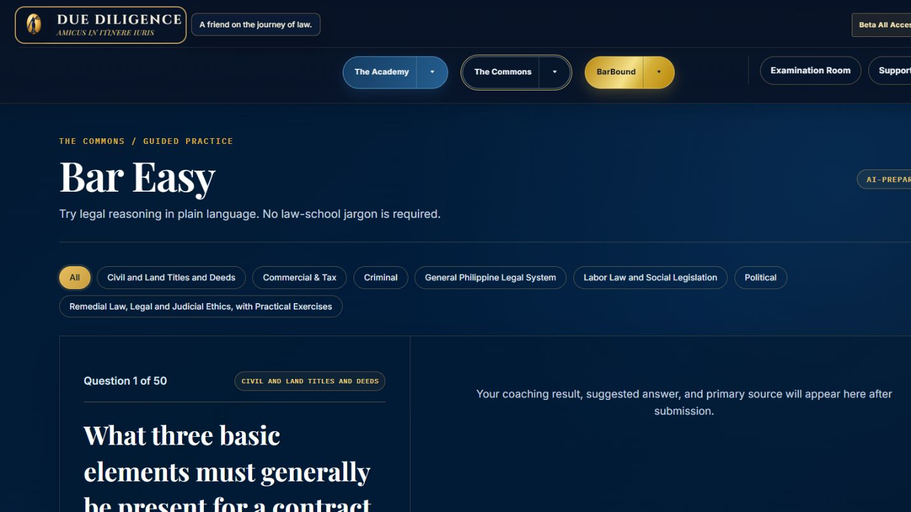
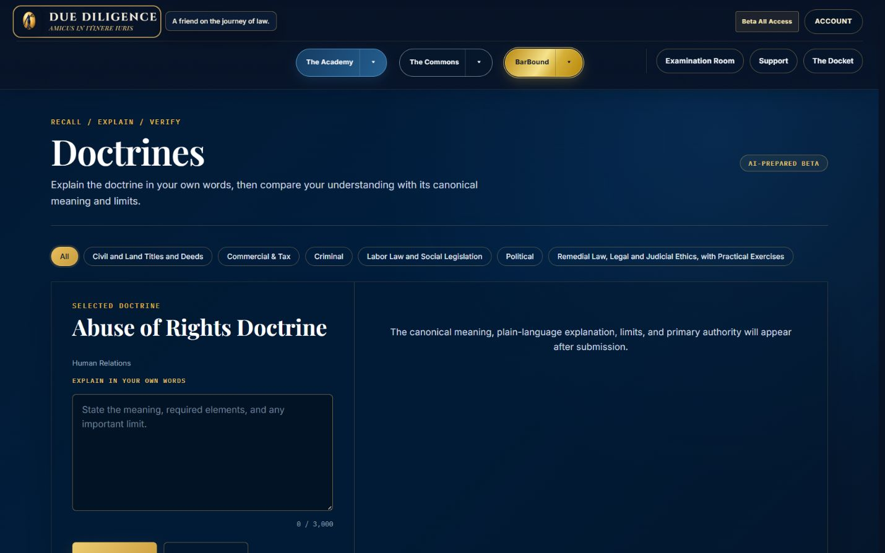
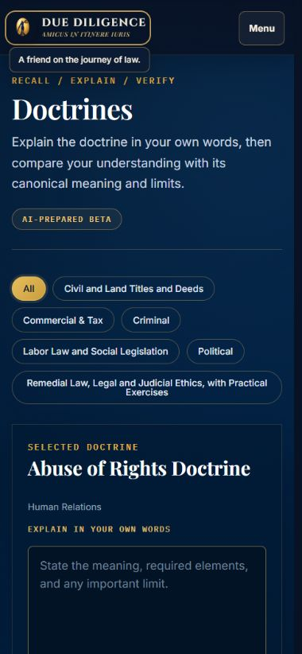
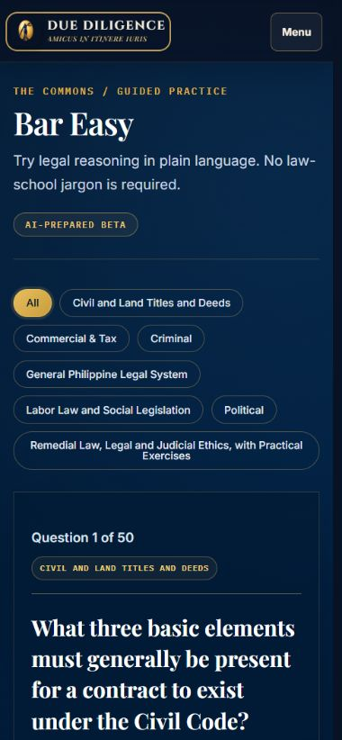

# Due Diligence Live Visual Reference Audit

Date: 2026-08-15

Source: production `https://duediligence.ph/`

Reference surfaces: Bar Easy and Doctrines
Viewports captured: 1440×900 and 390×844

This audit is the evidence baseline required by the Controlling Due Diligence Design Standard. No production interface was changed during this audit.

## Accepted screenshots

### 1. Bar Easy — desktop, 1440×900

Health: strong reference. The editorial hierarchy, navy canvas, ivory question typography, and restrained dividers establish the clearest current study-workspace language.

### 2. Doctrines — desktop, 1440×900

Health: strong reference. It shares the Bar Easy shell, typography, filters, two-pane rhythm, and result area without creating a separate feature identity.

### 3. Doctrines — mobile, 390×844

Health: usable reference. The single-column reflow and 44-pixel menu control work well. Long subject filters wrap, but they occupy too much vertical space and should not be copied into unrelated surfaces.

### 4. Bar Easy — mobile, 390×844

Health: usable reference. The question remains readable and the page has no horizontal overflow. The long filter stack is the main visual-density weakness.

## Measured production language

| Element | Desktop | Mobile | Standard to preserve |
|---|---:|---:|---|
| Page title | Playfair Display, 57.6px/61.1px, 600 | Playfair Display, 36px/38.2px, 600 | Editorial serif with compact leading |
| Legal question / doctrine | Playfair Display, 36px/51.1px, 700 | Playfair Display, 25px/35.5px, 700 | Large, calm, high-contrast legal text |
| Intro body | Inter, 16px/26.9px, 400 | Inter, 16px/26.9px, 400 | Readable sans-serif body copy |
| Metadata label | IBM Plex Mono, 11px, 600, 0.17em | Same | Use sparingly for metadata only |
| Main text | `#F8FAFC` / white | Same | Ivory-white primary text |
| Supporting text | `#CBD5E1`, `#B8C4D3`, `#94A3B8` | Same | Restrained slate hierarchy |
| Gold accents | `#C5A059`, `#D4AF37`, `#E7BD5D` | Same | Antique gold used for guidance, not large fields |
| Main canvas | `#021326`, `#061C35`, `#0A2542` family | Same | Deep navy product canvas |
| Content width | 1360px maximum shell | 100% minus 15–20px gutters | Generous editorial width and deliberate gutters |
| Pane padding | 30px 34px | 20px | Calm, consistent spacing rhythm |
| Primary/secondary actions | 46px minimum height, 6px radius | 46px, full width where required | Standard accessible action height |
| Header controls | 40–44px height | 44px menu target | Shared header baseline and touch target |
| Inputs | 52px minimum; textarea 190px | Same | Dark navy field with gold border and visible focus ring |
| Pane border | 1px translucent antique gold | Top divider after stacking | Restrained separation without white cards |

Observed responsive results:

* 1440 viewport: document width 1430px; no horizontal overflow.
* 390 viewport: document width 380px; no horizontal overflow.
* Shared navigation collapses at 900px into one accessible Menu control.
* Two-pane study layouts stack on mobile while preserving question-first reading order.

## Interaction-state inventory

The current production rules define:

* Primary action: gold treatment, navy label, 46px minimum height.
* Secondary action: translucent navy, ivory label, gold border.
* Hover: stronger gold border and restrained color lift.
* Keyboard focus: visible three-pixel gold focus ring.
* Disabled: gray-navy background, muted label, no shadow or movement.
* Inputs: distinct hover, focus, invalid, disabled, and read-only states.
* Reduced motion: transitions and animations collapse to effectively zero duration.

The new controlling standard intentionally overrides two weaker details visible in the current reference implementation:

1. Bright gold gradients must become a restrained solid or near-solid antique gold treatment.
2. Pill shapes and monospace labels must remain limited to genuine metadata, filtering, or compact status use—not become the default interface language.

## Strengths to carry forward

1. Playfair Display and Inter create a clear legal-editorial hierarchy.
2. Deep navy, ivory, and antique gold feel authoritative without relying on decorative cards.
3. Large legal text is readable and visually primary.
4. Thin gold dividers establish structure with little visual noise.
5. The two-pane desktop model naturally separates work from feedback.
6. Mobile reflow preserves a single, understandable reading order.

## Risks the visual gate must prevent

1. Subject-filter pills already consume substantial vertical space on mobile; they must not be replicated as general navigation.
2. IBM Plex Mono is currently used for full action labels; the controlling standard limits it to restrained metadata where appropriate.
3. Bright gold gradients and glows conflict with the new restrained-gold rule.
4. Repeated boxed panels elsewhere would weaken the publication-like quality established by these references.
5. Default screenshots do not prove all hover, focus, loading, disabled, error-recovery, keyboard, or assistive-technology behavior; those require the implementation test gate.

## Visual approval gate

No redesign may begin until one coherent preview set is produced and visibly approved for all of the following:

* Desktop homepage
* Mobile homepage
* Academy chamber page
* Commons chamber page
* BarBound chamber page
* Shared header
* Subject Matter with all reveals closed
* Subject Matter with legal basis open
* Subject Matter with guidance open
* Representative primary, secondary, tertiary, disclosure, and destructive button groups
* Representative error state

Each preview must be compared beside these live reference screenshots at the same viewport. Source-code assertions alone do not satisfy the gate.

## Evidence limits

This evidence confirms visible default-state hierarchy, production computed styles, content width, and responsive reflow at 1440 and 390 pixels. It does not claim WCAG conformance. Keyboard behavior, 200% zoom, 1024/768/375/320 widths, fallback-font behavior, loading/error transitions, and assistive-technology output remain mandatory checks for the future approved implementation.
