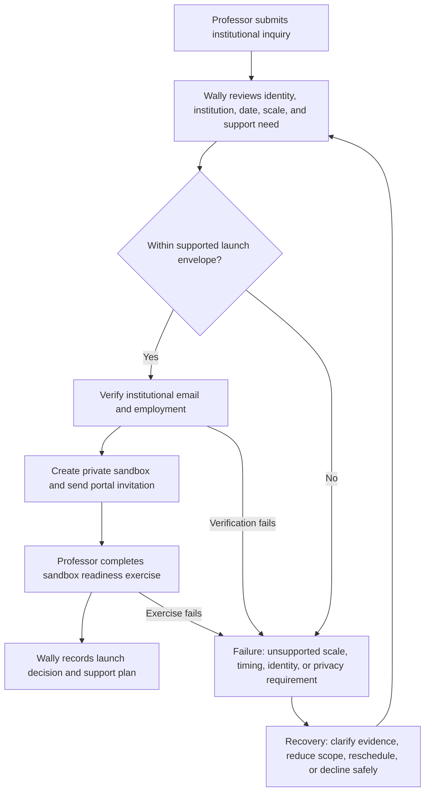
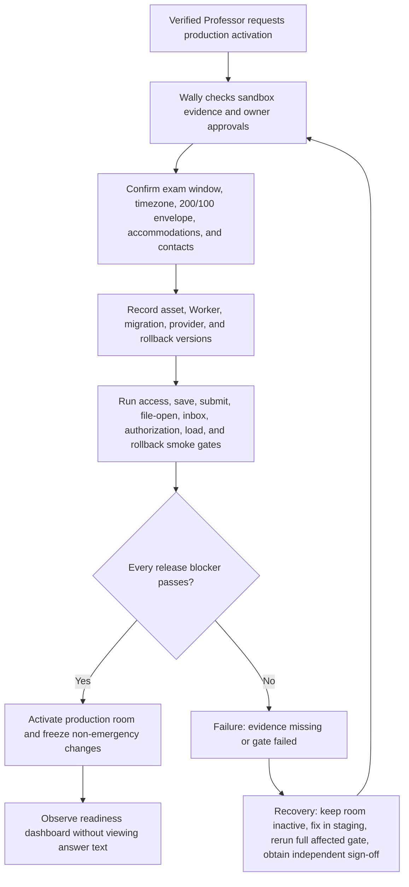
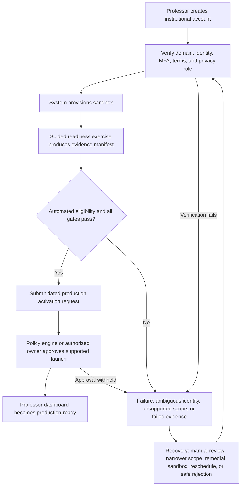

# Real-World Commercial Operating Model

## Purpose and boundary

This is the operating model for a law Professor who wants to use Due Diligence for an actual class. It covers inquiry through archive and support without designing consumer pricing, payments, or SIS integration. The launch model is deliberately high-touch until the product proves reliability in real conditions; it does not make Wally a daily bottleneck after activation.

## Service promise

- A verified Professor receives a private workspace and sandbox.
- The Professor can create, publish, operate, grade, and release without a developer, Beadle, old email, or redundant grading key.
- Wally/Admin handles identity verification, provisioning, readiness approval, incident escalation, delivery/queue diagnostics, and audited break-glass support.
- Students receive a clear institutional route, durable work, an authoritative receipt, and portal-first results.
- Optional Beadles can assist with roster/waiting-room logistics but cannot see answers, grades, model answers, or release controls.

## Roles and decision rights

| Role | Normal authority | Explicit exclusions |
|---|---|---|
| Professor / examination owner | Create/import/review; configure; publish; monitor; pause/resume; extend; reopen; grade; preview; release; amend; archive owned exams | Cannot cross classes; cannot erase audit/history; cannot delegate unrestricted ownership through a link |
| Student | Enter authorized exam; manage own attempt; submit; keep receipt; view own released result | Cannot view peers, model answers before permitted release, grading drafts, or monitoring data |
| Optional Beadle | Roster help, waiting-room status, identity correction request, incident note, session-transfer request | No answer text, model answers, grading, release, exports containing protected content, or AI commands over those data |
| Wally/Admin | Verify Professor; provision sandbox/workspace; readiness gate; status/queue diagnostics; scoped retry; candidate-specific break-glass after fresh MFA | No routine answer viewing; no bulk answer access; no silent grade/release mutation; no self-approval of production readiness |
| Assistant Proctor | Professor-facing navigation and permission-checked read-only summaries; draft a confirmed command | No direct database access, autonomous grading/release, cross-class access, or hidden mutation |

## Launch-stage lifecycle

### 1. Inquiry and qualification

Collect only institution, Professor identity/contact, course/class, approximate candidate count, exam date/time/time zone, question count/format, accommodations needs, and requested support. Do not collect student data or exam content during general inquiry. Provide privacy/retention terms, supported envelope, incident route, and a clear statement that email is secondary.

### Diagram 1 — Professor inquiry and onboarding

### 2. Verification and sandbox

Wally verifies the request using an institutional domain plus an independent employment/course signal. The Professor accepts terms, enables MFA/step-up authentication, and receives a sandbox that behaves like production without real student records. The readiness exercise requires manual creation, DOCX import, safe text-PDF import, publish without Beadle, test Student entry, grading, portal release, failed-email fallback, a download that opens, and return from a new browser.

### 3. Manual production launch

The production examination is not activated merely because a workspace exists. Wally runs the evidence checklist 72–24 hours before access opens, records the exact frontend/Worker/database versions, confirms support contacts, and freezes non-emergency deployment during the exam window.

### Diagram 2 — Manual launch operations by Wally

### 4. Independent Professor operation

After activation, the Professor's dashboard is the control plane. Wally is not required to create, import, publish, admit, grade, download, or release. Support uses examination/attempt/job receipt IDs; it never asks for passwords, one-time keys, or a copy of a student's answer by email.

## Future self-service onboarding

Self-service is a later operating mode, not a launch shortcut. It may automate identity checks, terms, MFA, workspace/sandbox creation, capacity selection, readiness exercises, and activation requests. Production activation still needs policy-driven gates, fraud/abuse controls, privacy review, support coverage, and an auditable risk decision. High-risk or unsupported cases route to Wally.

### Diagram 3 — Future self-service onboarding

## Operational timeline

| Time | Professor | Wally/Admin | System evidence |
|---|---|---|---|
| 2–4 weeks before | Inquiry, privacy/course details | Verify and provision sandbox | Verification record, terms version |
| 1–2 weeks before | Complete readiness exercise; prepare real content | Review blocker evidence and scale | Sandbox evidence manifest |
| 72–24 hours before | Finalize rules/roster/accommodations | Version pin, inbox/file/load/rollback checks | Launch checklist and GO/NO-GO record |
| Before access | Publish; inspect receipt and Student preview | Confirm observability/support coverage | Immutable publication version |
| During exam | Monitor status; use audited incident controls | Diagnose infrastructure only; scoped break-glass if authorized | Attempt/session/incident/command receipts |
| After submission | Grade early/final candidates; save and preview | Support queues/renderers without answer access | Grade revisions and export jobs |
| Release | Choose package and scope; portal release; monitor email | Assist retry only | Candidate release versions and email job status |
| Correction/archive | Amend/reissue if needed; close/archive | Retention/export support | Amendment and archive audit |

## Wally / authorized Admin operating checklist

| # | Required operation | Exact boundary and evidence |
|---:|---|---|
| 1 | Verify Professor identity | Institutional account/email plus independent employment/course evidence; verification actor/time/source recorded |
| 2 | Confirm school, subject, course, section | Professor confirms normalized class context; do not infer from email domain alone |
| 3 | Confirm expected Student count | Record supported versus stress envelope; >200 requires NO-GO or separately proven capacity |
| 4 | Confirm exam date/duration | Store local time, IANA time zone, duration, access window, support window, accommodations process |
| 5 | Confirm roster control | Record simple default or institutional roster requirement and collision owner |
| 6 | Confirm optional Beadle/assistant | Invite only after Professor chooses; show exact scope/expiry/revocation; no required handoff |
| 7 | Create Professor access | Provision verified account/membership; require MFA; never send reusable password/key |
| 8 | Activate Professor workspace | Bind owner to class context and sandbox; record membership receipt |
| 9 | Provide sandbox | Production-like features with dummy candidates and no real Student data requirement |
| 10 | Provide onboarding | Portal instructions and optional guided demonstration covering recovery/failure, not only happy path |
| 11 | Confirm escalation | Name P0 route, exam ID location, support hours, safe evidence, and no-credential/no-answer rule |
| 12 | Monitor email queues | Metadata/status/provider events only; retry job independently; never change publication/release |
| 13 | See stuck submissions | Intent/generation/receipt status and timestamps, not answer text by default |
| 14 | See failed answer/flag sync | Candidate/question IDs, revisions/hashes/pending counts, session/network metadata; content only via approved break-glass |
| 15 | See failed grade saves | Professor/candidate draft revisions and conflict/error metadata; Admin cannot choose score/comment |
| 16 | See failed result release | Candidate/version/command receipt and validation reason; only Professor can correct/finalize/release |
| 17 | See failed downloads | Source snapshot, renderer/version, validation/error/artifact status; regenerate without domain mutation |
| 18 | See failed Assistant commands | Allowlist/function/proposal/permission/command receipt and redacted model error; circuit-break assistant only |
| 19 | Recover without answers | Use metadata, hashes, revisions, receipts, session leases, and local-evidence status first; candidate-specific break-glass only if strictly necessary |
| 20 | Disable new entry safely | Audited entry-control command; active attempts and journals remain; communicate impact; never archive/delete as shortcut |
| 21 | Roll back bad frontend/Worker | Freeze rollout, inventory versions, pin compatible clients, route new loads to last-known-good, preserve DB/IndexedDB |
| 22 | Preserve audit evidence | Snapshot incident/version/command/job/auth timeline and retention hold; no mutable spreadsheet as sole audit |
| 23 | Revoke Professor access | Assess active exams/ownership transfer first; revoke membership/sessions with reason; preserve history |
| 24 | Archive/cancel service relationship | Legally complete/cancel exams, resolve attempts/incidents/jobs, apply retention/deletion policy, revoke access, record commercial closure |

Admin status pages must default to metadata and must not expose bulk Student answers. Service-role capability never grants product authority; every permitted intervention still has actor, scope, reason, receipt, and independent review where break-glass is used.

## Later scalable service lifecycle

| Stage | Self-service behavior | Human/escalation boundary |
|---|---|---|
| Registration | Institutional account, domain/identity verification, MFA, terms/privacy role | Ambiguous/fraud/high-risk institution routes to Wally |
| Service selection | Select supported class/question envelope, exam timing, support level, sandbox | Pricing/package text remains unimplemented until commercial approval |
| Payment or institutional approval | Integrate only after separate payment/procurement plan; until then record manual approval reference | No use of the existing Student ₱149 price as Professor price |
| Workspace and sandbox | Automatic private class context/sandbox after eligibility | Failed provisioning is retriable and does not create duplicate ownership |
| Guided onboarding | Evidence-producing manual/import/publish/Student/grade/release/failure exercises | Failed readiness routes to remediation or manual review |
| Production activation | Policy evaluates approved identity, capacity, date, privacy, gates, support coverage | Unsupported/failed case stays inactive; Wally may approve only within policy |
| Usage limits | Show supported Students/questions/storage/job quotas before publish | Hard limit fails safely before active attempts; increases need new evidence |
| Support escalation | In-product exam/support ID and severity route | P0/P1 reaches staffed human; AI is never sole support |
| Renewal | Review usage, incidents, retention, terms, readiness evidence, and future dates | Commercial owner approves terms; no silent auto-renewal assumption |
| Suspension | Block new creation/entry while preserving owned records/active-exam safety under policy | Active exams require incident plan; never destroy attempts |
| Revocation | Revoke membership/session after ownership/retention obligations handled | High-impact confirmation and audit; no orphaned live exam |

Self-service cannot approve itself based only on completed UI steps. It must produce the same evidence manifest and enforce the same NO-GO conditions as manual launch.

## Support model

### Channels and severity

The dashboard displays one incident route and examination ID. P0 means active answer/submission loss, authorization breach, or room-wide inability to proceed; P1 means serious degradation with a safe workaround; P2 means isolated non-core failure; P3 means guidance. P0 stops deployments and pages Wally/Admin. Professor actions remain in the ordinary UI whenever safe.

### Support evidence

Support may request the exam ID, attempt/receipt ID, timestamp/time zone, visible error ID, browser/device, and whether a safe retry was attempted. It must not request credentials or answer text. Diagnostics default to metadata. Answer access requires a candidate-specific, time-limited break-glass reason, fresh MFA, dual review, and immutable audit; ordinary incidents should not need it.

### Cancellation and postponement

- Before publication: Professor cancels a draft; audit remains, no Student exposure.
- After publication but before attempts: cancel with reason and explicit Student notice; publication remains immutable.
- With active attempts: prefer pause while impact is assessed. Cancellation requires high-impact confirmation, scope summary, reason, and a recovery/alternate-assessment plan. Never delete answers.
- Commercial cancellation/refund policy is an owner decision outside implementation; it must not be encoded until approved.

## Optional Beadle operating boundary

The Professor may invite a Beadle for logistics. Invitation is scoped to a class/exam, expires, can be revoked, and lists permitted actions. Every action is attributable. The Professor can complete the entire examination without a Beadle. The Beadle is never a credential courier or a recovery dependency.

## Commercial and privacy boundaries

- No consumer price or payment design in this phase.
- State the supported service envelope and support hours; do not sell unproven 500/200 capacity.
- Define institution/controller and Due Diligence/processor responsibilities before production.
- Collect the minimum identity data; configure retention and deletion by record class, with legal holds and audit-history exceptions.
- Do not send answer text or class-wide data to Gemini. Do not use continuous camera/microphone recording.
- Separate production Gemini project/key, quotas, logs, rotation, and incident ownership from development if Assistant Proctor/import assistance is enabled.
- Never promise guaranteed email delivery; promise authoritative portal availability and observable retries.

## Launch approval checklist

The first commercial class remains NO-GO until: the Professor completes the sandbox uncoached; production versions are recorded; all release-blocking tests pass; real files open; controlled inbox and provider events work; portal fallback works with email disabled; shared-NAT and submission bursts pass; accessibility passes; rollback preserves active attempts; privacy/retention/support terms are accepted; an independent reviewer signs the evidence; and Wally makes an explicit dated GO decision.
