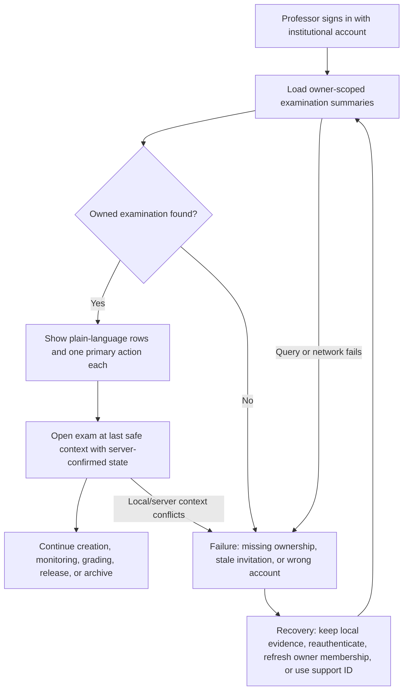
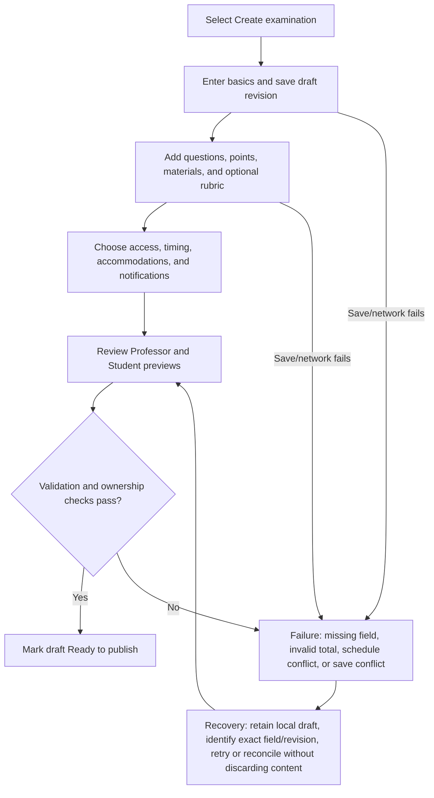
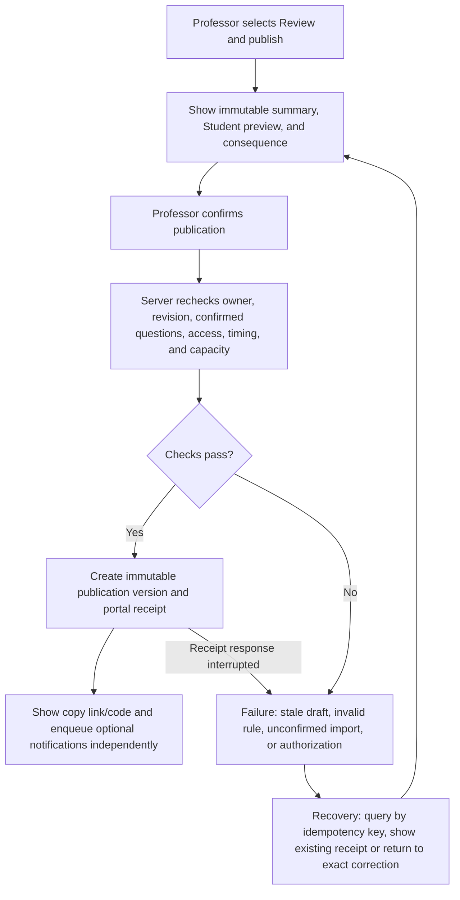
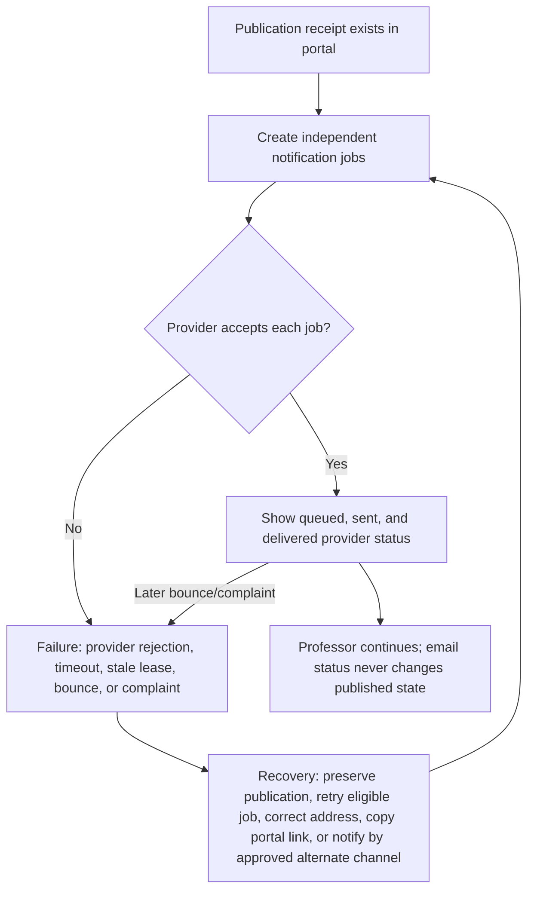
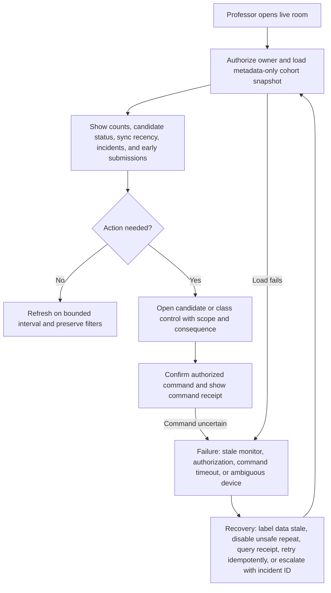

# Professor Journey

## Journey contract

The Professor owns one uninterrupted journey:

**Request → sandbox → create/import → review → rules → publish → share → monitor → intervene → grade submitted work → save/resume → preview results → release → amend/reissue → archive.**

Authentication and ownership replace old email links and redundant grading keys. Every examination has one obvious primary action; secondary actions live in a stable More menu. The dashboard is both the starting point and recovery route.

## Dashboard and return

The signed-in dashboard opens with a compact list grouped into Needs attention, Upcoming/open, Grading, Released, and Archived. Each row shows title, course/section, scheduled time in local time zone, plain-language status, candidate progress, latest confirmed activity, and one primary action. A global Create examination button is the only persistent creation control.

| Examination condition | Primary action | Secondary actions |
|---|---|---|
| Draft, incomplete | Continue setup | Duplicate, cancel draft |
| Ready to publish | Review and publish | Student preview, duplicate |
| Published, not open | View room | Copy access, edit future-safe rules by new version, cancel |
| Open | Monitor | Pause, extend, close entry, incident log |
| Submitted candidates available | Grade submissions | Monitor active Students, export read-only snapshot |
| All grading final | Preview results | Download read-only reports |
| Some results released | Continue release | Amend released result, retry notifications |
| Complete | Archive | Reopen only through an audited, permitted lifecycle action |

### Diagram 4 — Professor dashboard and return flow

The dashboard must never require an old email, Beadle, publication key, or grading key. If the last browser has unsynced local evidence, it displays a specific recovery card after server state loads; it does not silently replace either version.

## Create manually

Creation uses a short stepper with autosaved drafts:

1. Basics: title, course/section, instructions, date/time zone.
2. Questions: add/reorder/duplicate/delete; prompt, optional subparts, points, materials, rubric/model answer visibility.
3. Access and timing: simple or roster mode, window, duration, accommodations, late entry.
4. Review: Professor and Student preview, warnings, publish.

Advanced integrity, notification, and retention settings are collapsed with safe defaults. Internal table/version/queue names never appear. Leaving the stepper returns to the dashboard and preserves a server-confirmed draft revision.

### Diagram 5 — Manual examination creation

## Import and review

Professor chooses DOCX or text PDF, sees validation before upload, and receives a non-authoritative draft. Gemini is optional: it may normalize numbering and fields and attach confidence/uncertainty, but every question remains unapproved until the Professor compares source and structured output and accepts or edits it. Parser/Gemini failure returns to manual creation with the source retained according to policy; it never publishes partial content. Full requirements are in [08_DOCX_PDF_AND_GEMINI_IMPORT.md](08_DOCX_PDF_AND_GEMINI_IMPORT.md).

## Rules and publication

Rules show outcomes in plain language: who can enter, when they can start, duration, permitted materials, accommodations, late-entry policy, and what Students receive after submission. Publication validates ownership, confirmed questions, timing, access configuration, and capacity; then creates an immutable publication version.

The receipt contains exam title/version, course, window/time zone, duration, access mode, candidate-facing link/code, Student preview, notification status, and immutable publication ID. Publication success does not wait for email. Editing content or material rules after publication creates a deliberate new version and clearly describes impact on waiting/active attempts.

### Diagram 8 — Publication and sharing

### Diagram 9 — Email failure during publication

## Live monitoring

Monitoring shows counts and operational metadata, not answer text: expected/admitted/waiting/active/offline/reconnecting/submitted/auto-submitted/needs attention; remaining-time ranges; save/sync recency; duplicate sessions; accommodations; incident status. Default refresh may poll at a documented interval, with action confirmation at p95 ≤3 seconds under supported load.

The Professor can filter candidates and open a candidate drawer containing identity, timing, connection/save health, submission receipt status, and audited actions. Active answer text is never shown. Early-submitted work becomes available in a separate grading queue.

### Diagram 18 — Professor live monitoring

## Intervene safely

Emergency controls are grouped by impact:

- Low impact/read-only: refresh status, view incident metadata, copy support ID.
- Candidate-scoped: extend time, correct verified identity, revoke/transfer session, reopen submission.
- Class-scoped: pause/resume, extend selected/all, close entry, end/cancel.

Each mutation names target(s), current state, exact effect, reversibility, reason requirement, and confirmation. The server independently authorizes current state and idempotency key. The UI shows `Confirmed`, `Already applied`, `Rejected with reason`, or `Status unknown—check receipt`; it never assumes success after a timeout. Detailed flows appear in [07_STATE_MACHINE_AND_DATA_CONTRACTS.md](07_STATE_MACHINE_AND_DATA_CONTRACTS.md).

## Grade and resume

Submitted/auto-submitted/sealed candidates may be graded while other Students remain active. One-page Student grading is default; question-by-question is optional. Each editable field has a local recovery journal and a revisioned server draft. The visible state is one of Editing, Saving locally, Syncing, Saved at timestamp, or Needs attention. A browser close/logout/device change cannot erase server-confirmed work; a conflict preserves both versions and asks the Professor to reconcile.

The Professor explicitly finalizes a grade after totals and required feedback validate. Finalization is distinct from release and remains reversible only through a reasoned new grade version. See [10_GRADING_AND_RESULT_RELEASE.md](10_GRADING_AND_RESULT_RELEASE.md).

## Preview, release, and delivery

Before release the Professor selects candidates and one of three standard packages:

1. Score only.
2. Score plus Professor feedback.
3. Full marked script: score, feedback, questions, Student answers, and permitted model answers/rubrics.

A custom package may be considered later only if privacy and comprehension testing pass. Preview renders exactly what the named Student will see. Release creates an immutable candidate version in the portal first. Email is queued second and may fail without removing access. Individual, selected, and whole-class scopes are supported.

## Correct, reissue, and archive

A released grade is never overwritten. Professor opens the candidate, selects Amend released result, enters a reason, changes the grade/feedback/package, reviews old versus new, and confirms with recent authentication. The new version supersedes the prior version but preserves both and creates a new portal receipt; notification can be retried independently.

Archive is available only when active attempts and unresolved release incidents are handled. It removes the examination from active views but preserves retention-bound records and audit. Restore/unarchive is owner/admin controlled and audited. Cancellation, completion, and archival are different user outcomes and must not share one ambiguous control.

## Success, failure, and recovery summary

| Stage | Success evidence | Failure signal | Recovery |
|---|---|---|---|
| Return | Owned exam and latest confirmed state visible | Missing exam, stale context, unsynced evidence | Reauth, membership repair, evidence reconciliation, support ID |
| Create/import | Server draft revision and source comparison | Validation/parser/Gemini/save error | Keep source/local draft; manual edit; retry exact step |
| Publish | Immutable portal receipt | Invalid/stale/unknown command | Query idempotency receipt; correct exact issue; never duplicate |
| Monitor/intervene | Fresh snapshot and command receipt | Stale data, timeout, state changed | Label stale; requery; idempotent retry; incident escalation |
| Grade | Server revision and visible saved time | Offline/conflict/validation | Preserve both drafts; reconnect; reconcile; refinalize |
| Release | Candidate portal version and release receipt | Missing final grade or delivery failure | Correct validation; portal remains; retry only notification |
| Amend/archive | Immutable superseding version/archive audit | Stale version, active attempts, unresolved incident | Reload comparison; resolve blockers; retry authorized transition |

## Professor acceptance

An uncoached Professor must complete the full journey, including an induced parser failure, email failure, disconnect, grade conflict, candidate extension, submission reopen, and amendment. No step may require an old email, Beadle, developer, grading key, or inspection of internal database/queue terminology.
