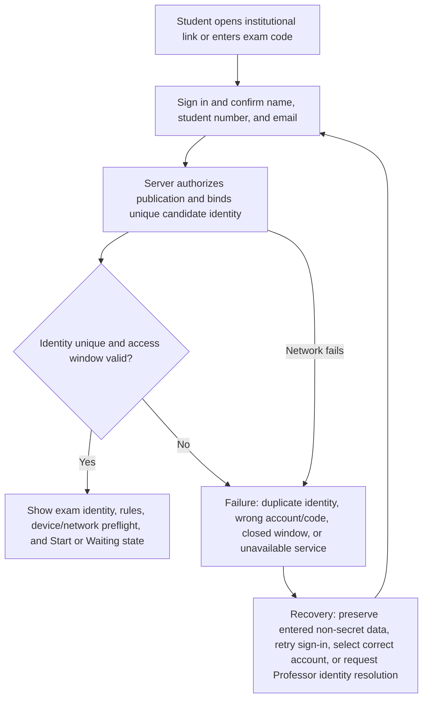
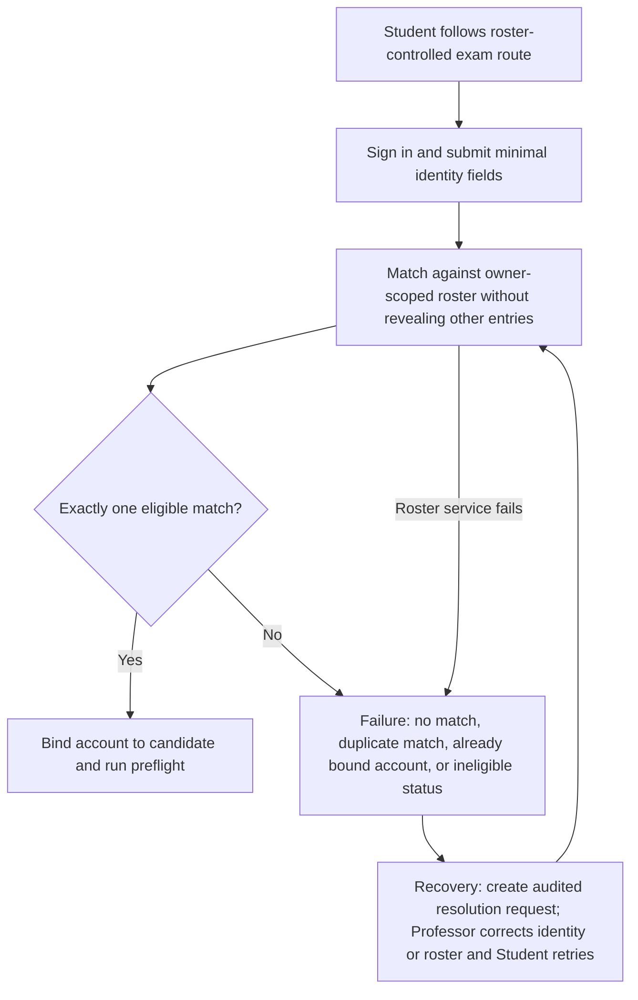
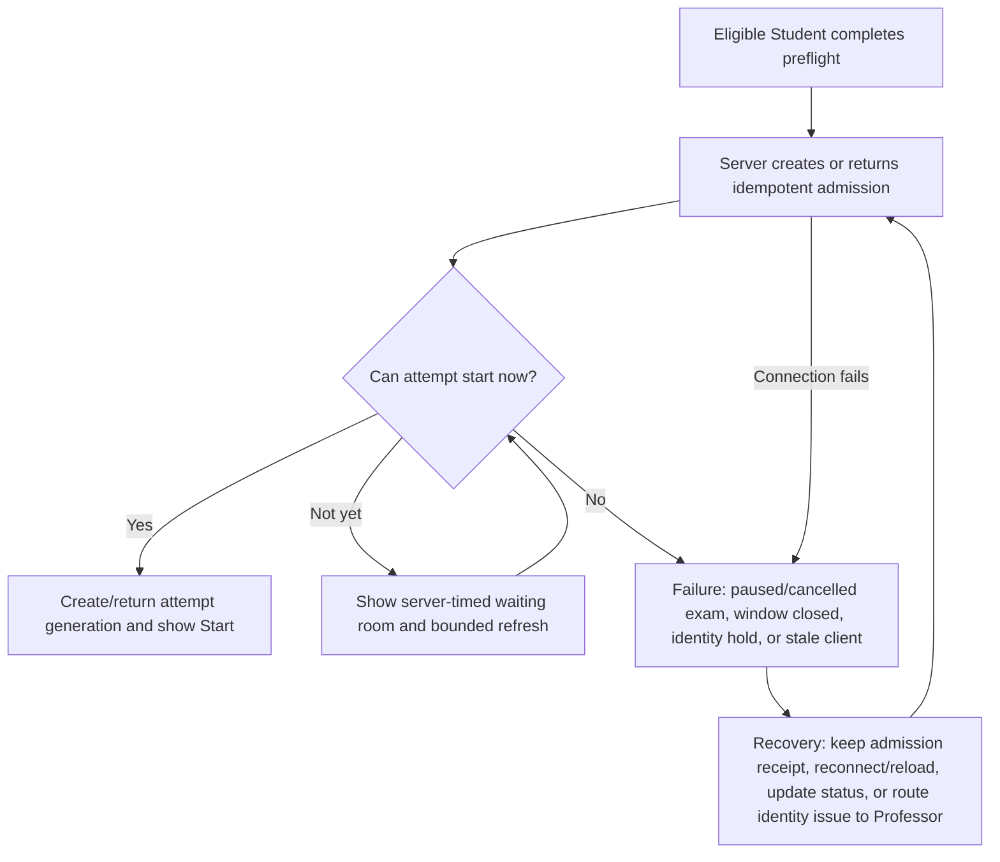
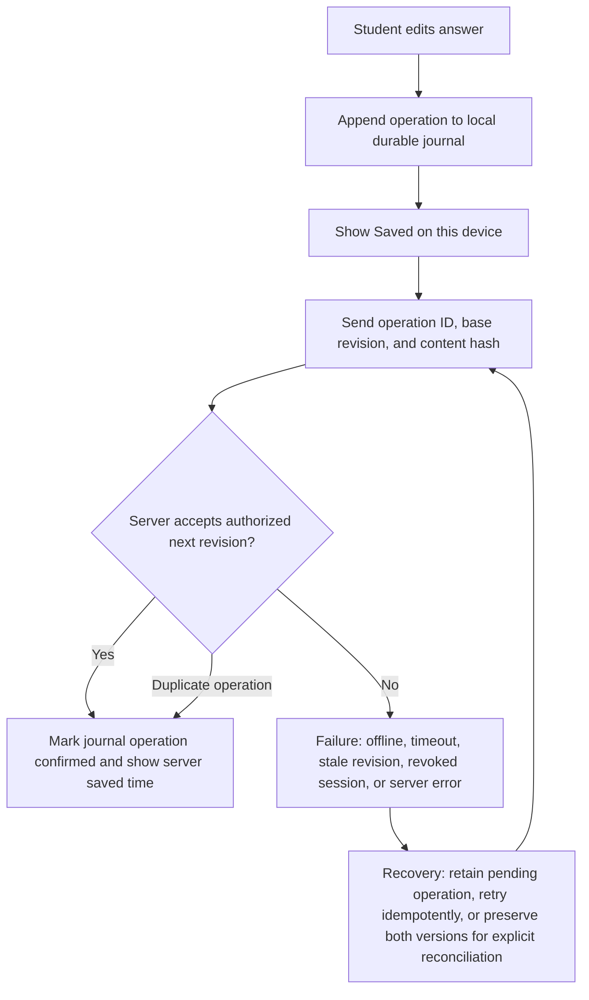
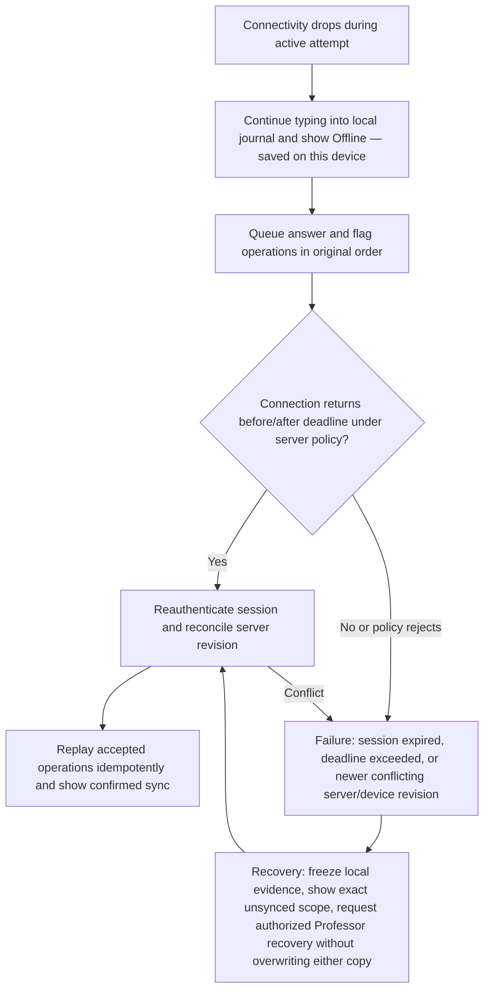
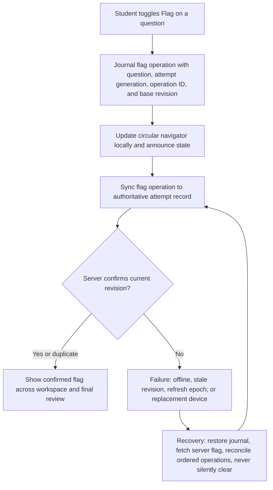
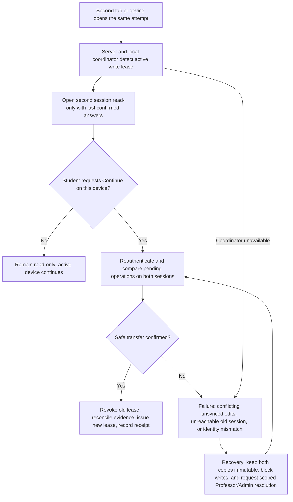
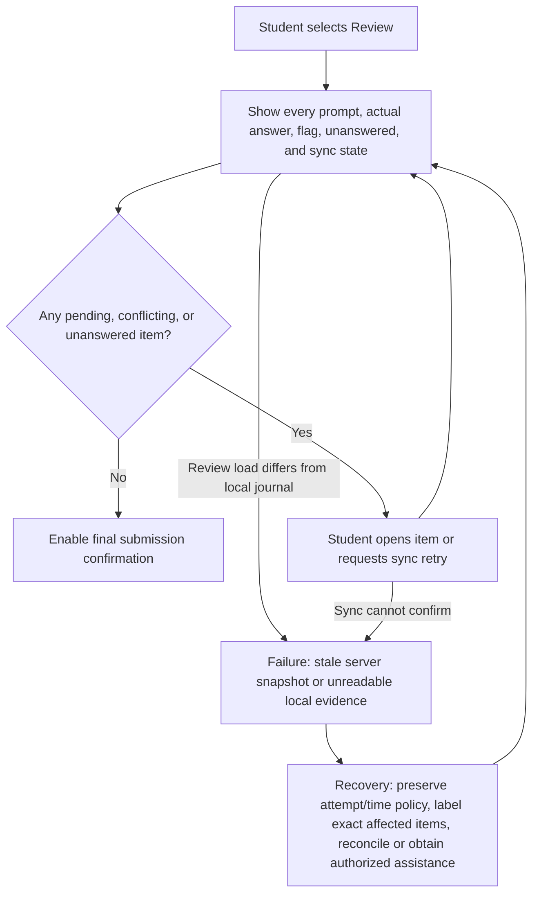
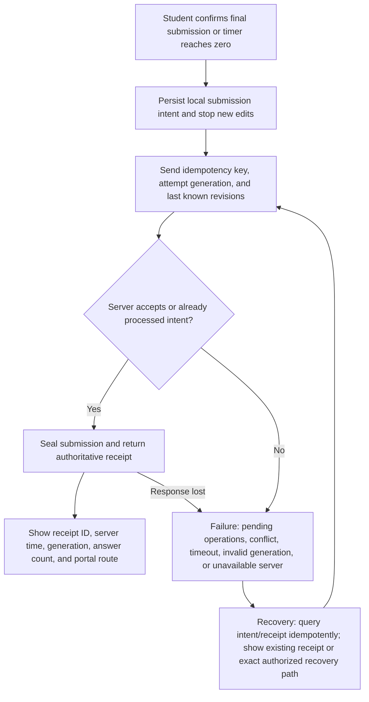

# Student Journey

## Journey contract

The Student journey is **access → sign in → identify → preflight → wait if necessary → start → answer → flag/navigate → save/sync → review → submit → receipt → later portal result**. It must remain calm under weak connectivity and clear under time pressure. The system preserves typing locally, confirms authoritative server sync, prevents silent overwrite, and never makes email the sole route.

## Access modes

### Simple classroom mode — default

The Student opens the institutional Examination Room, signs in, enters an exam code or follows a deep link, then confirms legal/display name, student number, and institutional email. The server binds the account to a candidate record. An exact unique match proceeds; an ambiguous duplicate is blocked for Professor resolution. The code locates the exam—it is not a bearer credential that bypasses identity.

### Diagram 10 — Student access in simple mode

### Roster-controlled mode — optional

Professor uploads or enters a minimal roster. Sign-in matches account/email/student number to one expected candidate. A mismatch never exposes roster data; it creates a pending identity-resolution item. Beadle may forward the request but only Professor or authorized policy can resolve it.

### Diagram 11 — Student access in roster mode

## Identity and preflight

The preflight page shows exam title/course, Professor, scheduled window/time zone, duration/accommodation, permitted materials, connectivity/save explanation, duplicate-device rule, privacy notice, and support route. It checks browser/storage/time skew/network without claiming that a check guarantees future reliability. Clipboard behavior remains normal unless a narrowly justified rule is approved; assistive technology and accommodation paths cannot be broken.

## Waiting room

The waiting room uses server time and plainly states why the Student is waiting. It shows identity, exam, scheduled start/time zone, device/network status, and a test-save status without question content. Start appears automatically only after server authorization; refreshing or reconnecting returns to the same admission record.

### Diagram 12 — Waiting room

## Examination workspace

The active workspace has a restrained header (exam title, save state, server-aligned remaining time), Times New Roman prompt and answer text, one primary answer area, a circular question navigator, Flag control, and Review/Submit. Instructions and permitted materials are accessible without covering the answer. Technical identifiers live only in a support detail.

Time is server-authoritative. The browser displays an estimated countdown and corrects drift without abrupt unexplained loss. At zero, it creates an idempotent auto-submit intent and shows the receipt or a recovery state. A pause freezes effective elapsed time on the server, not only the display.

## Answer save and sync

Every edit first enters a device-local journal with attempt generation, question ID, operation ID, base server revision, content hash, and timestamp. The UI may say `Saved on this device` only after journal commit. It says `Saved to Examination Room at 10:42:18` only after an authorized server acknowledgment. Retries reuse operation IDs. Conflicts never silently choose the server or client version.

### Diagram 13 — Answer save and sync

### Diagram 14 — Offline and reconnect

## Flag persistence and circular navigation

Flag is an attempt/question property with the same local-journal and server-revision discipline as an answer. It persists across navigation, refresh, reconnect, and authorized replacement device. The circular navigator combines state without color alone: current (double focus ring), unanswered (outline), answered (filled with check), flagged (gold flag marker), sync pending (small clock), and needs attention (red ring plus accessible label). Full visual tokens are in [06_UX_AND_VISUAL_SYSTEM.md](06_UX_AND_VISUAL_SYSTEM.md).

### Diagram 15 — Flag persistence

## Duplicate tabs and devices

One active session holds the write lease. A second tab/device is read-only and shows which session is active. The Student may continue there only through a deliberate transfer: verify identity, compare unsynced evidence, revoke the old lease, synchronize or quarantine its pending operations, then issue a new lease. Mere refresh of the same session must not create a duplicate attempt.

### Diagram 32 — Duplicate-device recovery

## Final review

Review shows actual question prompts and the Student's current answer excerpts/full answers, answer/save status, flag state, unanswered state, and remaining time. Selecting an item returns to it without losing text. A final server synchronization check distinguishes confirmed, pending-on-device, and needs-attention answers. Submission cannot misrepresent pending work as synced.

### Diagram 16 — Final review

## Submission and receipt

Final confirmation states that submission ends normal editing and names unanswered/pending items. The browser first persists a submission intent, then sends an idempotency key and expected attempt generation. The server seals the accepted revision and returns an authoritative receipt. Repeated clicks/timeouts return the same receipt. Auto-submit uses the same contract and is labeled accordingly.

### Diagram 17 — Submission and receipt

The receipt is available in the portal and supports browser print. It includes no peer/class data. Email may notify but is not the receipt authority.

## Later result portal

The Student signs into the same portal and sees Released results only for their candidate identity. The page identifies exam, release/amendment version, released timestamp, package contents, score/feedback as authorized, and download/print options. A superseding amendment is prominent; previous versions remain available only according to approved policy and audit requirements. A failed email does not hide the result.

## Student-facing save language

| State | Exact intent | Allowed behavior |
|---|---|---|
| Editing | Keystrokes not yet durably journaled | Do not navigate silently; journal immediately |
| Saved on this device | Local durable operation exists | Student may continue; warn before clearing site data/device transfer |
| Syncing | Authorized server confirmation pending | Continue typing; retain ordered operations |
| Saved to Examination Room at *time* | Server acknowledged current visible revision | Safe normal navigation |
| Needs attention | Conflict/session/policy prevents confirmation | Preserve text, identify affected question, provide recovery action |
| Submitted — receipt *ID* | Server sealed the generation | Normal editing locked; receipt and reopen policy available |

## Student acceptance

Across laptop, tablet, permitted mobile, strong/weak/offline connections, refresh, duplicate device, and accessibility needs, Students must enter uncoached, understand question circles, find a flagged item, distinguish local from server save, review actual answers, submit once, recognize the receipt, and later find portal results. Each critical flow is repeated at least five times; zero confirmed work may be lost.
