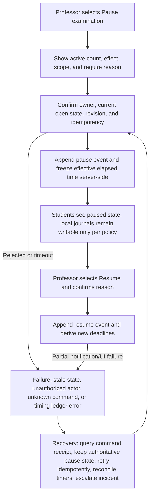
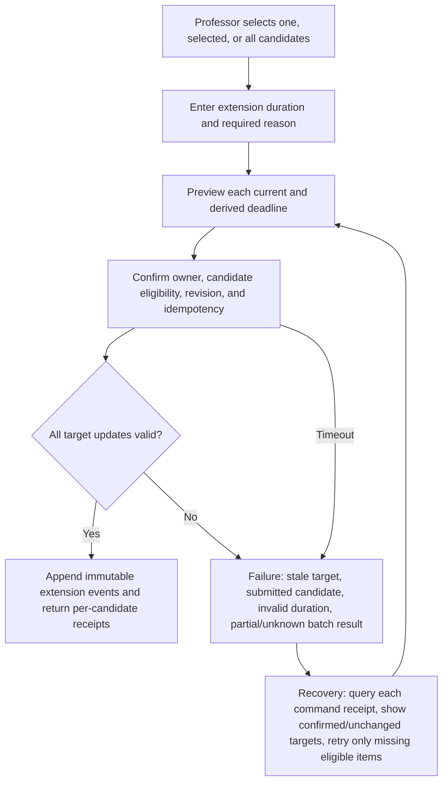
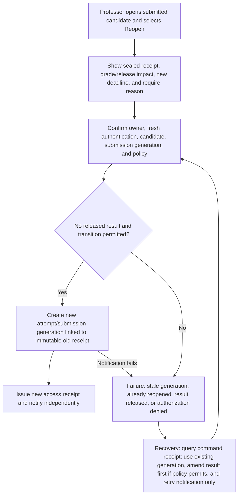
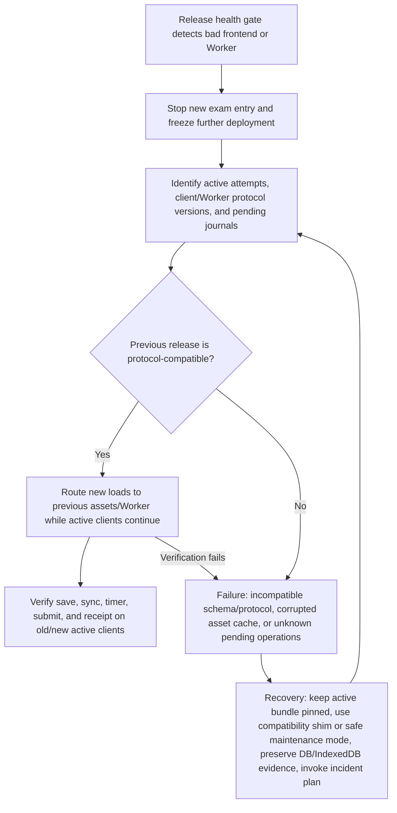

# State Machine and Data Contracts

## Architectural decision

Use server-owned, versioned aggregates for authoritative state and device-local journals for recovery. Every mutation is an authorized command with an idempotency key, expected revision, actor, scope, reason when required, and command receipt. UI state, email status, file generation, and Gemini/Assistant Proctor output are projections or jobs; they cannot mutate a domain aggregate implicitly.

## Aggregate boundaries

| Aggregate / record | Owns | Does not own |
|---|---|---|
| Professor Workspace / Class Context | Institutional owner membership, course/section, optional delegates | Exam content, candidate answer text |
| Examination | Draft identity, lifecycle, schedule policy, access mode, capacity, current publication pointer | Email/file/AI completion |
| Question Source + Publication Version | Original source metadata, normalized questions, approvals, immutable published snapshot | Mutable grading or attempt state |
| Candidate / Admission | Minimal identity binding, roster match, accommodation policy, access decision | Peer data, answer content |
| Attempt + Session Lease | Attempt generation, timing ledger, active writer, pause/extension effects, connection metadata | Grade/release state |
| Answer Operation / Revision | Per-question operation IDs, base/current revision, content hash/content, confirmed time | Flag or submission as an accidental side effect |
| Flag Operation / Revision | Per-attempt/question flagged state and ordered operations | Answer mutation |
| Submission Generation + Receipt | Sealed answer/flag revision set, method, server timestamp, supersession/reopen link | Grade finalization |
| Grade Draft / Grade Version | Revisioned marks/feedback/total, finalized version, history | Release/delivery state |
| Candidate Release + Amendment | Immutable result package/version, superseded-by link, portal availability | Email delivery |
| Email Job | Recipient/template/payload reference, lease, attempts, provider events, terminal outcome | Exam/grade/release mutation |
| Export Job / Artifact | Read-only source snapshot references, renderer version, validation, storage, expiry | Exam/grade/release mutation |
| AI Job / Proposal | Minimum input references, model/config, proposed structure/command, uncertainty, approval | Direct authoritative mutation |
| Audit Event / Incident | Actor, action, target, before/after refs, reason, receipt, correlation, timestamps | Editable replacement for source records |

Existing `exam_room_*` tables/RPCs should be mapped to these boundaries during implementation. Do not rename or migrate merely for conceptual purity; first add invariant tests, then make the narrowest schema change.

## Common command envelope

Every state-changing Worker command should conceptually accept:

```text
command_id / idempotency_key
actor_session_id and authenticated user
aggregate_type and aggregate_id
expected_revision
command_type
scope (class, selected candidates, one candidate, one submission generation)
reason_code and reason_text when required
confirmation_token for high-impact commands
client_observed_at and client_version
```

Every response returns `outcome` (`confirmed`, `already_applied`, `rejected`, `conflict`, `unknown`), authoritative revision/state, command receipt ID, server time, and recovery hint. A network timeout is `unknown`, never `confirmed` or automatically failed; the client queries by command ID before retry.

## Examination lifecycle

Proposed top-level states:

`draft → ready → published → open → access_closed → completed → archived`

Orthogonal overlays: `paused`, `cancelled`, `incident`, and `superseded publication`. Paused does not erase `open`; it freezes effective elapsed time. Cancelled is terminal for new entry but preserves attempts and evidence. `completed` means exam operations are over, not that every result email was delivered. Archive hides from active work only.

| From | Legal command | Result / guard |
|---|---|---|
| draft | mark ready | All required fields/questions validate |
| ready | publish | Owner, current revision, confirmed questions, schedule/access/capacity valid |
| published | open automatically/manually | Within policy; publication version fixed |
| published/open | publish superseding version | Only future-safe changes or explicit impact policy; old version retained |
| open | pause/resume | Reason, current state, idempotency; timing ledger updated |
| published/open | extend | Candidate/selected/class scope; append timing event |
| open | close access | Prevent new starts; active attempts continue unless separately ended |
| open/access_closed | complete | No active unhandled attempt or explicit policy-driven sealing |
| draft/published/open | cancel | Consequence confirmation; no deletion; active-attempt recovery plan |
| completed | archive | No unresolved blocker/incident; retention rules apply |

Illegal: editing an immutable publication in place; archiving an open exam; resuming a non-paused exam as if it changed time; completion that deletes attempts; export/email/AI completion that advances lifecycle; admin mutation without authorization and receipt.

### Legal examination-transition register

| ID | Current state | Next state | Allowed actor | Preconditions | Confirmation | Reason | Database mutation | Immutable evidence | UI behavior | Audit record | Failure / recovery | Automated test | Human test |
|---|---|---|---|---|---|---|---|---|---|---|---|---|---|
| T01 | Draft | Ready | Professor owner | Current revision; required basics/questions/rules valid; all imported fields approved | Review summary, then explicit `Ready` | No | Append draft-status revision | Validation result + revision | Primary action becomes Review and publish | Actor, old/new revision, validation | Preserve draft; link exact errors; retry after correction | Missing/invalid/stale/current | Professor corrects every validation class |
| T02 | Ready | Published | Professor owner | Fresh owner check; same revision; valid schedule/access/capacity; Student preview current | High-impact publish summary | No unless institutional policy asks | Insert immutable publication and current pointer atomically | Publication/command receipt | Show Published receipt before notification | Actor/version/rules/scope/outcome | On reject correct exact field; on timeout query command ID; never duplicate | Commit-response loss, stale, no Beadle, email off | Uncoached publish and recover ×5 |
| T03 | Published | Open | Server schedule or Professor where policy permits | Publication current; start window reached; not cancelled; capacity/health allowed | Manual early-open requires consequence confirmation | Early-open reason if outside schedule | Append open event; no publication rewrite | Lifecycle command receipt | Monitor becomes primary; Students may start | Trigger/actor/server time/version | Rejected remains Published; retry/query receipt | Schedule/timezone/duplicate/health guard | Scheduled and manual start scenarios |
| T04 | Published, no active attempt or policy-safe | Published with new version | Professor owner | Explicit impact analysis; immutable prior version; future-safe change or approved erratum rule | Side-by-side old/new and affected candidates | Required | Insert superseding publication; retain prior/current pointer policy | Both versions + supersession receipt | Label new version and affected/unaffected Students | Reason, versions, affected attempts | Invalid active impact blocks; create erratum or cancel/pause plan | Active/no-active, stale, rollback compatibility | Professor explains which Students see which version |
| T05 | Open | Open + Paused overlay | Professor owner; Admin only scoped incident policy | Current open/not paused; server timing ledger valid | Class impact/count/deadline effect | Required | Append pause timing/lifecycle event | Pause command receipt | `Paused at…`; no false countdown | Reason/actor/active counts/event | Timeout queries receipt; reconcile all timers; incident on ledger error | Duplicate/concurrent/offline clients | Whole-room pause under incident ×5 |
| T06 | Open + Paused | Open | Professor owner | Current paused event not resumed; server time available | New deadline effect | Required | Append resume event; derive per-attempt deadlines | Resume receipt + ledger | `Resumed`; announce derived deadline | Reason/actor/pause interval/deadlines | Duplicate rejected/already applied; query/reconcile | Double/stale/time skew/reconnect | Resume and verify accommodations ×5 |
| T07 | Published/Open/Paused | Same lifecycle + extension events | Professor owner | Eligible one/selected/all targets; duration bounds; current timing revisions | Per-target old/new deadline summary | Required | Append per-target extension events; derive deadlines | Per-target receipts | Mixed confirmed/unchanged/attention list | Actor/reason/old/new/scope | Query every target; retry only missing eligible target | Partial/timeout/submitted/stale | One, selected, class extension drill |
| T08 | Open | Access closed | Professor owner | Impact preview; policy says active attempts continue or separate sealing plan | Confirm new starts blocked | Required if earlier than schedule | Append access-closed event | Command receipt | New starts blocked; active count remains visible | Actor/reason/schedule delta | Unknown queries receipt; reopen entry only via separately approved transition | Active/start race/timeout | Close entry while Students active |
| T09 | Open/Access closed | Completed | Professor owner or server policy | No active unhandled attempt, or explicit policy seals/auto-submits each with receipt | Summary of candidate outcomes | Required for manual exceptional completion | Append completion plus per-attempt legal outcomes; no deletion | Completion and affected receipt manifest | Completed; grading/results primary | Actor/reason/candidate outcomes | Block on missing receipt; reconcile attempts before retry | Active/stuck/partial/duplicate | Professor completes after reconciling class |
| T10 | Draft | Cancelled | Professor owner | Owned draft | Confirm cancellation; recoverability/retention stated | Optional reason code | Append cancel event; keep revisions | Cancellation receipt | Remove from active drafts; recover/audit per policy | Actor/reason | Timeout query; no delete | Double/cancel stale/restore policy | Cancel dummy draft |
| T11 | Published, no active attempts | Cancelled | Professor owner | Publication exists; impact/notice plan | High-impact summary | Required | Append cancellation; prevent admission; keep publication | Cancellation + notice-job receipts | Cancelled and Student portal notice | Actor/reason/version | Email failure does not undo; copy/print notice | Admission race/email off/timeout | Cancel scheduled exam and verify portal |
| T12 | Open/Paused | Cancelled | Professor owner; Admin only incident boundary | Incident assessment; active attempt preservation and alternate plan | Strong confirmation with candidate counts | Required | Append cancel event and explicit per-attempt retained outcome; no erase | Candidate/attempt manifest + receipt | Stop new work according to policy; show recovery instructions | Actor/reason/incident/affected records | Prefer pause; unknown queries receipts; incident reconciliation | Active/offline/partial/rollback | Emergency cancellation drill |
| T13 | Completed/Cancelled | Archived | Professor owner; Admin service closure under policy | No active attempts; unresolved blockers handled; retention policy known | Archive effect/retention summary | Required if unresolved non-blocking warnings overridden | Append archive event/status only | Archive receipt; all histories retained | Move to Archive; restore policy visible | Actor/reason/retention version | Exact blockers; resolve and retry; no delete | Active/incident/double/auth | Archive and retrieve audit/result |
| T14 | Archived | Completed/Cancelled restored view | Professor owner or authorized Admin | Retention permits; source lifecycle known; no mutation to immutable records | Restore-to-active-list summary | Required | Append restore/unarchive event | Restore receipt | Return to completed/cancelled section, never reopen attempts implicitly | Actor/reason/old/new view state | Deny if retention/deletion prevents; support explains | Expired retention/auth/double | Restore archived record without changing results |

Any implementation that introduces another lifecycle transition must add a row with the same fields and owner approval before code.

## Attempt lifecycle

`eligible → admitted/waiting → active → submitted | auto_submitted | sealed_after_recovery → reopened(new generation) → resubmitted`

Sessions are leases beneath the attempt. Exactly one writer is active. Answer and flag operations are generation-bound; a reopened submission creates a new generation and does not alter the old sealed receipt. Timing is a ledger of start, pause intervals, and extensions; the derived deadline is reproducible.

Illegal: a second concurrent writer; editing a sealed generation; accepting an operation against the wrong candidate/question/publication; silently applying a stale revision; changing original start/deadline history; reopening without authorized reason and new generation.

### Attempt operational-state matrix

These are derived operational states where possible, not one overloaded mutable enum.

| State | Student sees | Professor sees | Answer editable? | Timer | Submit? | Recovery | New session? | Audit behavior |
|---|---|---|---|---|---|---|---|---|
| Not identified | Sign-in/identity form | No candidate or anonymous aggregate only | No | Not started | No | Sign in/use correct code | Yes, initial | Security/access attempts without leaking exam existence |
| Identity pending | Resolution message/support ID | Candidate identity request, no answer | No | Not started | No | Professor resolves binding; Student retries | Same auth session may continue | Request, match ambiguity, resolver, before/after identity refs |
| Ready | Preflight and Start | Eligible/not started | No | Not started | No | Correct preflight or wait for open | Start creates session | Admission/preflight outcome metadata |
| Waiting | Server-timed reason/start status | Waiting count/candidate metadata | No | Not started | No | Refresh/reconnect returns same admission | Same/new browser may resume admission | Waiting/admission transitions |
| In progress | Question workspace; confirmed timer/save | Active and sync recency only | Yes for writer | Runs unless server-paused | Yes after review/policy | Continue; transfer if duplicate | One writer lease required | Start/session/answer/flag/timing events |
| Saving locally | `Saving on this device…` | Active; no answer text; optional pending metadata | Yes | Runs unless paused | Not until durable review policy satisfied | Journal commit/retry; do not navigate silently before durable write | Same writer | Local telemetry optional; no false server audit |
| Syncing | `Syncing…` and pending count | Sync recency/pending attention metadata | Yes | Runs unless paused | Allowed only if submission contract reconciles pending ops | Idempotent replay/query | Same writer | Server accepted/duplicate/conflict ops |
| Offline | `Offline — saved on this device` | Offline/stale recency, no text | Yes while local journal healthy | Server timer runs unless paused | Intent may be stored; server receipt still required | Reconnect; retain all operations | Transfer only after reconciliation | Disconnect/reconnect metadata; local ops audited when received |
| Reconnecting | Ordered replay/progress | Reconnecting/pending count | Yes under journal policy | Runs unless paused | Wait for reconciliation or explicit policy | Reauth, replay, conflict handling | Lease revalidated | Reauth/replay/outcome/latency |
| Save problem | Exact questions/edits preserved; `Needs attention` | Candidate needs attention, metadata only | Yes locally or read-only if session revoked | Runs unless paused/policy | Block false clean submit; allow incident path | Retry/reconcile/Professor scoped recovery | May require deliberate transfer | Failure class/revisions/session; no answer in general log |
| Submission pending | Editing stopped; `Checking receipt` | Stuck intent metadata | No normal edits | Server deadline policy remains authoritative until outcome | Already requested | Query idempotency receipt; reconcile exact issue | No second writer | Intent/query/outcome timestamps |
| Submitted with receipt | Read-only receipt and script review per policy | Submitted/early-grade eligible | No | Stopped | Already submitted | Query/print same receipt; Professor reopen policy | No, unless new generation | Sealed revisions/method/time/receipt |
| Auto-submitted | Read-only receipt labeled automatic | Auto-submitted/early-grade eligible | No | Stopped | Already submitted | Same receipt path; incident if intent pending | No, unless reopened | Server time/policy/intent/sealed revisions |
| Reopened generation | New-generation instructions and prior receipt link | Reopened reason/deadline/new status | Yes after new generation starts | New timing ledger; original unchanged | Yes for new generation | Reenter/reconnect under new generation | Yes, new generation lease | Old/new link, reason, actor, deadline, receipts |
| Finalized attempt | Read-only submission/result eligibility as policy permits | Sealed and grading/result state | No | Stopped | No | No edit; amendment is grade/result process | No | Finalization/seal evidence retained |
| Invalidated | Plain reason and approved next step, no data erasure | Invalidated with reason/actor; answers protected | No | Stopped | No | Professor/Admin policy may create separate new generation/exam | Only through authorized new record | Reason/actor/source receipt; original evidence retained |

## Grade lifecycle

`not_started → draft → saved → finalized → released(version N) → amended/finalized(version N+1) → reissued`

Early grading is allowed only for a sealed submitted generation. A server-saved draft can be resumed; `finalized` freezes a version but is not visible to the Student. Release copies an exact final grade version into an immutable candidate result package. Amendment creates a new grade and release version, never overwrites the prior one.

Illegal: grading active answer text; releasing a browser-only draft; mutating a final/released version; class release with missing selected final grades; email delivery changing release; an Assistant Proctor or Admin automatically assigning a mark.

### Grade-state contract

| State | Authoritative record | Professor behavior | Student visibility | Legal next state | Recovery / immutable evidence |
|---|---|---|---|---|---|
| Ungraded | Sealed submission, no grade draft | Open candidate to create draft | None | In progress | Wrong generation rejected; submission receipt remains |
| In progress | Grade draft ID/current revision, possibly local pending ops | Grade in either mode; visible save state | None | Draft/Saved or Final | Refresh/device loads server draft; conflicts preserve both |
| Draft | Server-confirmed marks/comments/total revision | Resume/edit; validate; no release | None | In progress or Final | Every revision/history retained; no routine reason required |
| Final | Immutable grade version | Preview package; create reasoned correction draft | None until release | Ready for release or new pre-release correction version | Finalization receipt; correction never edits old version |
| Ready for release | Final grade + current exact result preview/package token | Select one/selected/class and confirm | None | Released | Stale source invalidates token; regenerate preview |
| Released | Candidate release references exact final grade/package | View delivery; start amendment | Latest authorized package in portal | Amended | Original grade/comments/Professor/release time/delivery retained |
| Amended | New final grade and superseding candidate release linked to original | Review history; choose reissue notification | Latest version plus approved amendment history | Reissued or another amendment | Reason, old/new values, actor/auth, comparison, receipt immutable |
| Reissued | Amendment portal version plus notification attempt history | Retry notification only if eligible | Latest portal version regardless of email | Another amendment if justified | Reissue time/jobs/events never overwrite release history |

## Non-destructive action contract

Every listed action has **zero authority** over examination, attempt, grading, or result state. It follows `read named revision → create separate view/job/artifact/activity record → return result → preserve domain revisions`.

| Action | Only permitted writes | Explicitly forbidden effects |
|---|---|---|
| Download PDF | Export job, artifact, download audit | No lock, finalize, release, complete, permission, or grade change |
| Download Excel/workbook | Export job, artifact, download audit | Same; no formula execution on server or grade import |
| Download offline copy | Export job/artifact/audit labeled reference snapshot | No offline authority and no online-grading disable |
| Export Student answers | Scoped export job/artifact/audit | No answer/submission/attempt mutation; no unrelated Student data |
| Export grades | Scoped export job/artifact/audit | No grade finalization/release or browser-draft overwrite |
| Print | Optional print/view audit | No domain or permission change |
| Preview | Optional preview cache/activity bound to source revisions | No publish/release/finalize; stale preview cannot confirm |
| View Student answer | Authorized read/audit | No seen/read flag that changes grade/attempt state |
| View model answer | Authorized read/audit | No Student visibility or grading state change |
| Generate file | Export job/artifact/audit | No domain mutation even on success |
| Regenerate file | New/retried export job/artifact/audit | No source revision change |
| Retry file job | Job attempt/status/audit | No domain compensation or workflow lock |
| Send email | Notification job/attempt/audit | No publication/admission/release creation or reversal |
| Retry email | Job attempt/provider event/audit | No duplicate domain event or portal change |
| Ask Assistant Proctor | Conversation/AI job/activity | No domain mutation from prose/function proposal |
| Run Gemini extraction | AI job/proposal/audit | No approval, publish, grade, or release |
| View audit record | Authorized access audit | No mutation/deletion of audit or source domain record |

## Publication versioning

- Drafts are revisioned mutable work owned by the Professor.
- Imported structure remains proposed until field/question approval is recorded.
- Publish snapshots content, order, points, rules, access/timing policy, and permitted post-exam material visibility.
- Active attempts reference one publication version.
- An erratum or superseding publication records reason and effect; it never rewrites what an earlier Student saw.
- Student/Professor preview must render from the exact version to be published or released.

## Emergency timing controls

### Diagram 29 — Pause and resume



### Diagram 30 — Time extension



### Diagram 31 — Submission reopen



## Job isolation contracts

### Email jobs

Release/publication exists before notification. Job state may be `queued → leased → accepted → delivered` or `retry_wait → failed_terminal`, with provider bounce/complaint overriding lesser states. Reclaim stale leases, use bounded exponential backoff plus jitter, preserve attempt history, and permit authorized retry/correct-address without recreating the domain event.

### Download/export jobs

An export reads a named authoritative snapshot revision and records renderer/schema/version. Completion requires non-empty semantic checks plus actual PDF/workbook open validation in testing. Only export-job/artifact/audit records may change. Artifact failure provides retry and support ID; it cannot unfinalize, release, seal, archive, or disable grading.

### AI jobs

Gemini receives the minimum permitted source fragment, never credentials or unrelated class data. Output is an untrusted proposal with model/config/input hash, confidence/uncertainty, and expiry. Parser/AI job state cannot mark questions approved, publish, grade, release, admit, pause, extend, or reopen. Professor action through ordinary authorized controls is required.

## Audit events

Audit every publish/supersede/cancel, admission/identity resolution, session issue/revoke/transfer, pause/resume, extension, submission/auto-submit/reopen, grade save conflict/finalize, release/amend/reissue, notification retry/address change, export creation/download, AI proposal/approval/rejection, delegate change, Admin break-glass, and archive/restore.

Minimum fields: event ID, server timestamp/time zone, authenticated actor and role, owner/class/exam/candidate scope, command and correlation IDs, before/after aggregate revisions (or immutable refs), reason, authorization decision, outcome, client/Worker version, and redacted metadata. Audit logs are append-only and do not duplicate full answer text by default.

## Rollback and compatibility

Active attempts must remain usable when a new frontend/Worker is rolled back. Deployments require protocol-version compatibility: old client/new Worker and new client/old Worker for the active window, or a pinned client bundle until attempts end. Never clear IndexedDB, rotate schema incompatibly, invalidate active session leases, or delete queued operations during rollback.

### Diagram 34 — Rollback and active-attempt preservation



## State invariants to enforce

1. No publication without confirmed question structure and owner authorization.
2. No active attempt without one publication version, candidate binding, generation, timing ledger, and one writer lease.
3. No confirmed save without a server revision; no lost local operation after an ambiguous response.
4. No submission without an idempotent receipt; no reopen that changes an old receipt.
5. No grade access to an active unsubmitted answer; no release without a final grade version and exact preview package.
6. No amendment by overwrite; no email/export/AI job side effect on domain state.
7. No class/candidate mutation without authorization, current revision, bounded scope, and receipt.
8. No rollback procedure may delete browser/server evidence or force incompatible assets into active sessions.

## “Twenty moves ahead” downstream-impact register

The paired tables below form one 22-field record for each required critical action. Fields 3–5 report the verified current route where available; `UNVERIFIED` means the exact current symbol must be traced again in the implementation phase. Fields 6–22 state the target contract. Common browser gateway: `assets/duediligence-2026.js:460` to Worker `/exam-room/query`, `/exam-room/command`, upload, PDF, or workbook handlers. Common permission rule: the server derives the authenticated actor and independently checks owner/candidate/exam scope.

### Records, fields 1–11

| ID | 1 User intent | 2 Preconditions | 3 Current frontend | 4 Current Worker route | 5 Current RPC / database | 6 State read | 7 State written | 8 Downstream dependencies | 9 Permission boundary | 10 Idempotency | 11 Concurrency risk/control |
|---|---|---|---|---|---|---|---|---|---|---|
| C01 Create examination | Start a new owned draft | Verified Professor workspace | Professor creation render in `assets/duediligence-2026.js`; exact symbol UNVERIFIED | Exam Room command family; exact command UNVERIFIED | Existing exam/question draft tables/RPC family; exact RPC UNVERIFIED | Owner/class context and current draft quota | New draft ID/revision only | Paste/import, rules, preview, publication, dashboard | Professor owner; Admin cannot create invisibly | Client command ID returns existing draft on retry | Double-click/tab/device; expected workspace revision and one draft receipt |
| C02 Paste questions | Add prepared text to draft | Owned mutable draft/current revision | Manual question editor; exact symbol UNVERIFIED | Exam Room command | Question-version/draft RPC; exact name UNVERIFIED | Draft revision, question order, limits | New question draft revision/provenance | Review, points, preview, publish | Owner only | Paste operation ID + source hash | Concurrent edits preserve both/reject stale expected revision |
| C03 Upload DOCX | Import prepared DOCX safely | Owner, supported source, mutable draft | Upload UI via common API | Upload handler around `worker/duediligence-2026-routes.mjs:1562-1601` | Private question source/version records | Owner/draft, file bytes/hash, parser limits | Source/job + unapproved structured draft; no publish | Review, Gemini proposal, retention, files | Owner-scoped upload/source read | Source hash/job key reuses safe result | Duplicate uploads/jobs; lease once, revisions on review |
| C04 Upload PDF | Import bounded text PDF | Same plus text-based safe PDF | Upload UI; current target missing | Same upload/parser route | Current PDF inspection returns `manual_required`; target source/job/draft | Owner/draft, bytes/pages/security metadata | Source/job + unapproved text draft or explicit failure | Review/manual fallback, retention | Owner only; private source | Hash/job key | Duplicate parser work; bounded leased job; no partial accepted draft |
| C05 Gemini normalization | Get optional structural proposal | Deterministic blocks, consent, approved project/quota | No verified Exam Room path | No verified current Exam Room function; target AI job route | No verified current normalization RPC; target AI proposal record | Selected minimum blocks/provenance, owner/policy | AI job/proposal only | Professor comparison; cost/privacy/audit | Owner opt-in; AI has no DB authority | Source/config hash and job key | Stale proposal cannot apply to new draft revision |
| C06 Confirm questions | Approve exact imported/manual content | Owned draft, source comparison, all required fields | Question review/confirm UI; exact symbol UNVERIFIED | Exam Room command | Question confirmation/version RPC family | Draft/source/proposal revisions and warnings | Per-field/question approvals in new draft revision | Rules, preview, publication | Owner only | Approval operation IDs | Stale review rejects; no bulk AI approval; merge explicit |
| C07 Set rules | Define access/timing/materials/accommodations | Owned draft/current revision, confirmed questions | Rules render near `assets/duediligence-2026.js:4381-4531` | Exam Room command | Exam/publication rule RPC family | Draft, schedule, access mode, policy bounds | New rule draft revision | Preview, publish, admission, timing | Owner; step-up only for published-impact change | Rule-save operation ID | Concurrent/stale rule edits reject with comparison |
| C08 Publish | Create immutable usable exam version | Current reviewed draft, owner, valid rules/capacity | Publish UI near `assets/duediligence-2026.js:4766` | Exam Room command; legacy `publish_for_beadle` path exists | Publication/version/credential RPC family | Owner, expected draft, approvals, rules, schedule | Immutable publication + receipt; notification job separately | Student access, monitor, attempts, later preview | Owner; impact confirmation; no required Beadle | Publication command key returns same receipt | Double confirm/timeout/stale draft; transaction and expected revision |
| C09 Share access | Give Students route/instructions | Existing publication receipt | Publication-sharing UI/email controls | Query plus independent delivery route | Publication read + email/export job records | Publication/access policy and selected recipients | Clipboard/print only; optional notification job | Student entry, support, delivery | Owner; recipient scopes; code not auth bypass | Notification/job key per publication/recipient/template | Duplicate email/regen code; preserve version and job history |
| C10 Student check-in | Bind identity and become eligible/waiting | Published exam, signed-in Student, valid window | Student access/identity UI; exact symbol UNVERIFIED | Exam Room query/command admission family | Admission/roster/candidate RPCs | Publication/access mode, account, roster/collisions | Idempotent candidate binding/admission/identity hold | Waiting/start, receipts, monitoring | Student self only; Professor resolves ambiguity | Account/exam admission key | Duplicate identities/devices; unique constraints and explicit hold |
| C11 Start examination | Begin authorized timed attempt | Eligible admission, open/not paused, preflight | Student Start control | Attempt-start command | Attempt/session/timing RPC family | Publication, admission, accommodation, active lease | Attempt generation, start event, one writer lease | Answer/flag/timer/monitor/submit | Bound Student candidate only | Admission/start key returns same generation | Repeated click/tab/device; unique active generation/lease |
| C12 Save answer | Preserve answer locally and server-side | Active generation/write lease/question | Store journal + active UI (`assets/examination-room-2-store.js`) | Answer command/query family | Answer ops/revisions/conflicts tables/RPCs | Base/current answer revision, session/generation | Local op then authorized server next revision | Review, submit, grading, files | Bound Student/session/question | Operation ID + content hash | Offline/replay/two writers; one lease and expected revision |
| C13 Flag question | Mark question for return | Active generation/write lease/question | Toggle `assets/duediligence-2026.js:5682-5693`; current local store only | None verified currently; target flag command | No institutional server flag found; target flag ops/projection | Current local/server flag revision | Local op then server flag revision | Navigator, review, Student recovery | Bound Student/session/question | Flag operation ID | Refresh epoch/offline/device; ordered ops and expected revision |
| C14 Navigate questions | Move without losing answer/flag | Attempt loaded; current item journaled | Student navigator render; current rectangular CSS | Read query only if item data absent | No domain write; optional local position record | Question order, answer/flag/sync status | Local last-position only; no exam lifecycle state | Save, flag, review, accessibility | Bound Student; no extra privilege | Not applicable to navigation; data fetch cache keyed by version | Rapid clicks/render race; journal before context switch |
| C15 Reconnect | Sync pending work after disconnection | Local journal, valid or recoverable session | Store/controller retry/recovery | Answer/flag/session query/commands | Current revisions/session lease | Pending ops, server revisions, timing/session policy | Confirmed answer/flag ops or preserved conflict; reconnect audit | Review, submit, monitor, timing | Same Student; transfer if lease changed | Original operation IDs in original order | Reconnect herd/stale lease/device conflict; jitter and reconcile |
| C16 Submit | Seal final attempt once | Active generation, final review, operation reconciliation/policy | Student submit UI/controller | Submission command | Submission generation/intent/receipt RPC family | Attempt generation, final accepted answer/flag revisions, timer | Sealed submission and immutable receipt | Early grading, reopen, files, results | Bound Student; server policy at deadline | Durable intent/idempotency key | Double click/burst/commit-response loss; unique generation receipt |
| C17 Receive receipt | Verify submission outcome | Submit intent known or sealed generation | Submission success/recovery UI | Receipt/status query | Submission receipt tables/RPC | Intent/generation/candidate | No domain mutation; view/print audit only | Recovery, Professor monitor, later result | Candidate Student and owner metadata scope | Query by intent/receipt | Stale UI/response lost; always return one authoritative receipt |
| C18 Reopen submission | Allow authorized correction after accidental submit | Owner, sealed generation, policy guard, reason/deadline | Existing reopening UI/path indicated; exact symbol UNVERIFIED | Reopen command family | Existing reopenings/generation records | Old receipt, grade/release state, candidate/timing | New generation linked to immutable old receipt | Student entry/save/resubmit; grading queue | Professor owner, fresh auth/reason | Reopen command key | Repeated/stale/released case; one child generation and receipt query |
| C19 Extend time | Give candidate/selected/class extra time | Owner, eligible targets, reason/current revision | Current partial controls UNVERIFIED | Timing command | Existing session/accommodation data; target timing-event RPC | Timing ledger, target states, current deadlines | Append extension events and derived deadlines | Student timer, monitor, auto-submit, audit | Professor owner; scoped confirmation | Per-target command keys | Partial batch/stale submitted target; per-target outcomes |
| C20 Pause | Freeze whole open exam | Owner, open/not paused, reason | No verified normal UI | Target lifecycle/timing command | Current lifecycle lacks pause; target timing events | Open state, active attempts/timing ledger | Append pause event/overlay | All timers, entry, monitor, submit policy | Professor owner; Admin only emergency boundary | Pause command key | Multiple Professors/timeouts; state guard and receipt |
| C21 Resume | Continue paused exam fairly | Owner, currently paused, reason | No verified normal UI | Target lifecycle/timing command | Target timing events | Pause event, active attempts, server time | Append resume event; derive new deadlines | Timers, auto-submit, monitor | Professor owner | Resume command key | Duplicate resume/partial clients; state guard and derived ledger |
| C22 End examination | Close entry/complete under policy | Owner, impact preview, active attempts handled/policy | Lifecycle UI exists for end access/complete/archive | Lifecycle command | `exam_room_update_lifecycle_v1` supports end access/complete/archive | Exam/attempt states, incidents | Access closed or completed event; never delete attempts | Start/submit/grade/archive | Owner; reason/confirmation when active impact | Lifecycle command key | Active attempts/stale monitor; legal transition and per-attempt sealing policy |
| C23 Save grade | Preserve marks/comments/total draft | Owner, sealed submission generation, current draft | Grading UI `assets/duediligence-2026.js:7274-7445`; local draft `:7112-7154` | Grading command | Owner-scoped revisioned grade save in `20260811173745...:822-932` | Submission, grade draft/current revision, rubric | Local journal then new server grade-draft revision/history | Finalize, files, preview/release | Owner only; no Beadle; no normal key | Field operation/command IDs | Multi-tab/device/stale revision; preserve both/merge explicitly |
| C24 Finalize grade | Freeze complete grade version, not release | Owner, all required saved fields/total, sealed generation | Current UI exact symbol UNVERIFIED | Grade command | Grade/version/history RPC family | Current server draft/submission/rules | Immutable final grade version | Preview/release/amendment | Owner; confirmation; reason only if replacing prior final | Finalize command key | Stale draft/double finalize; expected revision returns same version |
| C25 Download PDF | Obtain read-only snapshot artifact | Authorized actor, named server revision/package | Download controls near grading/results (`assets/duediligence-2026.js:7390-7400`) | Exam result PDF route/renderer | Export preparation/completion in `20260812015047...:238-412` | Named publication/submission/grade/release snapshot | Export job/artifact/audit only | Support/print; never grading/lifecycle | Owner or candidate/package scope | Export key from source/version/type | Duplicate job/stale browser draft; same artifact or separate harmless job |
| C26 Download workbook | Obtain read-only class/selected grades | Owner, selected saved revisions | Workbook download UI | Workbook route/renderer | Same export job family | Named grade/release/candidate snapshot | Export job/artifact/audit only | Offline reference/reporting; no grade authority | Owner only; selected scope | Export key | Large/duplicate generation; queued bounded job and snapshot isolation |
| C27 Release one grade | Publish exact result to one Student portal | Owner fresh auth, final grade, current preview/token/package | Results/release UI | Candidate release command | Candidate release version RPCs in `20260813191000...` lineage | Final grade, sealed submission, publication, package, candidate | Immutable candidate release + receipt; email job separately | Student portal, delivery, amendment | Owner; explicit confirmation | Candidate/version/package command key | Double release/stale preview/response loss; unique version receipt |
| C28 Release class grades | Publish frozen eligible set | Owner fresh auth, per-candidate finals/previews | Class results/release UI | Batch/candidate release command | Candidate release batch/version records | Eligibility manifest and exact candidate versions | Per-candidate immutable releases/receipts + batch record | Portal/delivery/amendments | Owner; class confirmation | Batch key + per-candidate keys | Partial/timeout/stale candidate; mixed outcomes never rolled back blindly |
| C29 Retry email | Retry notification without changing domain | Existing publication/release, eligible failed job | Delivery-status retry UI | Email delivery/admin-safe retry route | Durable outbox/event tables in `20260813190000...` | Domain receipt and job attempts/provider state | New job attempt/status/audit only | Notification visibility/support | Owner for recipient; Admin scoped diagnostics | Release/recipient/template + attempt-safe provider key | Click/reclaim/provider duplicate; lease and event precedence |
| C30 Amend grade | Correct released result with history | Owner fresh auth, released version, reason | Amendment UI not fully verified | Candidate grade/release command family | Candidate version/history foundation; exact amendment RPC UNVERIFIED | Original grade/release/delivery and current policy | New grade final + amendment/superseding release records | Student portal, reissue, exports/audit | Owner; reason, preview, confirmation | Amendment command key bound to old version | Concurrent correction/stale preview; one superseding chain |
| C31 Reissue grade | Notify/present approved amendment | Existing amendment release version | Delivery/amendment UI not fully verified | Email job route; portal already authoritative | Candidate release + outbox | Latest amendment/release, recipient | Notification attempt/audit only; portal unchanged | Delivery history/support | Owner; recipient scope | Amendment/recipient/template key | Repeat email/events; lease/idempotency/precedence |
| C32 Archive examination | Remove completed work from active view | Owner, completed/cancelled, no active attempts/unresolved blocker | Lifecycle/archive UI exists | Lifecycle command | `exam_room_update_lifecycle_v1` archive path | Exam lifecycle, active attempts, incidents/retention | Archive event/status; no deletion | Dashboard, retention, audit/export | Owner; Admin service closure under policy | Archive command key | Stale active attempt/double archive; legal guard/receipt |
| C33 Assistant navigation | Open safe Professor destination | Assistant enabled, owner session, allowlisted route | No current implementation | Target closed Assistant dispatcher | No domain RPC; route allowlist/activity record | Current owner workspace/page context | Client navigation/activity only | Ordinary UI/context | Professor; server resolves allowed route IDs | Request/proposal ID | Ambiguous target/stale page; bounded choices, no mutation |
| C34 Assistant read-only query | Explain/find/summarize owned metadata | Same plus explicit scope/function | No current implementation | Target allowlisted read dispatcher | Existing owner query RPCs via bounded adapter | Minimum metadata and revision/time | AI/activity record only | Monitoring/grading navigation/support | Professor; no Beadle/other owner/active answer | Query request ID/cache by revision | Stale/model ambiguity; timestamp and server permission every call |
| C35 Assistant mutating command | Prepare and confirm permitted intervention | Allowlisted operation, server preflight, current revision, reason, short token | No current implementation | Target proposal + ordinary command route | Existing/target domain command RPC; AI never calls DB directly | Actor/target/current state/policy/proposal | Domain mutation only after independent server confirmation + receipt | Timing/session/etc named by command | Professor owner; v1 grade/release excluded | Proposal ID + command idempotency key | Model error/stale/replay/timeout; token-bound exact scope and receipt query |

### Records, fields 12–22

| ID | 12 Network-failure behavior | 13 Gemini-failure behavior | 14 Email/download dependency | 15 Browser-refresh behavior | 16 Cross-device behavior | 17 Audit event | 18 User-visible status | 19 Recovery path | 20 Rollback behavior | 21 Automated test | 22 Human test |
|---|---|---|---|---|---|---|---|---|---|---|---|
| C01 | Local draft intent retained; query command ID | None | None | Dashboard returns existing draft | Server draft visible; pending local reconciled | Draft created with actor/revision | `Draft created` or `Checking creation receipt` | Reauth/query receipt/reconcile | Hide new entry, retain draft | Double-click/timeout/owner | Create/close/return ×5 |
| C02 | Journal pasted text; retry revision | None | None | Restore server + pending local | Conflict comparison | Question draft revision/provenance | Local/sync/saved/attention | Reconcile both versions | Use compatible editor; preserve revision | Large paste/Unicode/offline/conflict | Paste/edit/refresh/device ×5 |
| C03 | Job status resumes; upload retry by hash | Optional stage failure leaves deterministic draft | None | Return to job/source/review | Owner sees same server job | Source uploaded/parser job/approval events | Validating/processing/review/failed | Correct/retry/manual | Disable parser; keep source/draft | Golden/adversarial/idempotent upload | Real DOCX correction ×5 |
| C04 | Same as DOCX | Same | None | Same | Same | Source/parser warnings | Honest text draft or exact manual-required failure | Searchable re-export/manual | Disable PDF parser; source preserved | Text/scan/encrypted/corrupt/bounds | Real text PDF + scan recovery ×5 |
| C05 | AI job retry by choice; draft unaffected | Explicit failed job; manual path | None | Proposal/job persists separately | Server proposal scoped to owner | AI request/model/config/outcome/approval | `Assistant unavailable; continue manually` | Discard/retry/manual | Circuit-break AI only | Quota/timeout/schema/privacy/stale | Opt out/failure/manual completion ×5 |
| C06 | Local approvals journaled; server revision required | Existing proposal remains untrusted | None | Restore approval summary | Server draft/approvals visible | Field approval/edit/reject | Approved count/warnings/Saved time | Reconcile/review exact item | Old UI reads same draft; no publication | Missing/AI field/stale/bulk guard | Verify all source pages ×5 |
| C07 | Preserve local edits; no false save | None | None | Restore server revision/pending local | Conflict explicit | Rule revision/actor | Saved time or exact validation | Correct/reconcile | Compatible rule schema/defaults | Timezone/invalid/stale/auth | Configure/preview uncoached ×5 |
| C08 | Unknown until receipt query; no duplicate | None at publish | Email queued only after; no download | Return to immutable receipt | Dashboard exposes receipt | Publication/confirmation/receipt | `Published` only with receipt | Query command; fix exact validation | Old client reads version; no deletion | Commit-response loss/duplicate/no Beadle | Publish with email off ×5 |
| C09 | Clipboard/print local; jobs retry independently | None | Email optional; download instructions read-only | Receipt remains | Portal/dashboard same | Share/copy/print/job attempt | Link/code + real delivery state | Copy/print/retry job | Disable email/export; publication stays | Provider off/duplicate/privacy | Share without email ×5 |
| C10 | Preserve entered fields; admission query retry | None | None | Same admission/hold | Binding prevents parallel identities | Check-in/match/resolution | Ready/waiting/identity needs attention | Correct account/Professor resolution | Compatibility route; no candidate deletion | Simple/roster/duplicates/cross-user | Entry median target ×5 |
| C11 | Start outcome unknown; query generation | None | None | Return active/waiting state | Second device read-only/transfer | Start/session lease | Start/Waiting/Needs attention | Query generation/transfer | Pin compatible client; keep attempt | Double start/pause/window/lease | Preflight/start/refesh ×5 |
| C12 | Continue local journal; ordered retry | None | None | Restore journal + server revision | Second device read-only; deliberate transfer | Answer op accepted/conflict | Device-saved/syncing/server-saved/attention | Reauth/replay/compare | Preserve DB/IndexedDB/protocol | Offline/replay/conflict/two devices | Type through failures ×5 |
| C13 | Same journal/replay | None | None | Never clear flag; restore/reconcile | Same server flag after authorized transfer | Flag op accepted/conflict | Navigator flag + sync state | Replay/compare; Professor recovery if policy | Dual-safe protocol; preserve ops | H07 epoch/offline/device | Flag/find after each interruption ×5 |
| C14 | Navigate locally; unavailable question remains cached/clear error | None | None | Restore last position; answers authoritative separately | Position may differ; answers/flags same | Optional navigation telemetry only | Current question and save state | Return to last safe/choose question | Old navigator reads same data | Rapid nav/focus/journal order | Keyboard/touch/AT circles ×5 |
| C15 | Backoff/jitter; pending remains | None | None | Recovery resumes | Lease conflict invokes transfer | Offline/reconnect/replay outcomes | Offline/Reconnecting/Saved/Attention | Ordered replay or preserve conflict | Pin compatibility; never clear | Herd/shared NAT/stale session | Whole-class reconnect + individual ×5 |
| C16 | Persist intent; query receipt; stop edits | None | None | Pending or same receipt | Other device queries receipt/read-only | Submit/auto-submit/receipt | Submitting/Submitted receipt/Attention | Reconcile pending ops or authorized policy | Compatible receipt endpoint; pin client | Burst/timeout/double/offline zero | Submit/recognize proof ×5 |
| C17 | Retry read; receipt server-authoritative | None | Print/download is optional reference | Receipt route restores | Same receipt on any authorized device | Receipt viewed/printed | Receipt ID/time/generation | Query by intent/candidate; support ID | Old/new portal compatibility | Lost response/privacy/idempotency | Close before response/return ×5 |
| C18 | Unknown command; query receipt/generation | None | Notification optional | Dashboard/Student sees new or old state | New generation can transfer normally | Reopen reason/new generation | Reopened receipt or exact rejection | Use existing generation; resolve policy | Disable UI; generations remain | Repeat/stale/graded/released guards | Accidental submit recovery ×5 |
| C19 | Per-target unknown; query receipts | None | Notification optional | Timers derive from ledger | All clients fetch same deadline | Extension reason/old/new deadline | Confirmed targets and deadline | Retry missing only; reconcile timer | Disable control; ledger remains | Partial/timeout/skew/class | One/selected/all extension drill |
| C20 | Unknown; query pause receipt | None | Notifications optional | Reload derives paused state | All devices server-paused | Pause reason/event | `Paused at…` plus effect | Idempotent query/retry; incident | Disable control; ledger remains | Concurrent/timeout/offline clients | Whole-class pause drill ×5 |
| C21 | Same | None | Same | Reload derives resumed/deadlines | Same | Resume reason/event/deadlines | `Resumed; new deadline…` | Query/reconcile timers | Same | Duplicate resume/derived timing | Resume comprehension/timer drill |
| C22 | Unknown; query lifecycle receipt | None | Notice/export optional only | Dashboard returns authoritative status | Same status | Close/end/cancel reason/outcome | Access closed/completed/cancelled, not technical enum | Handle active candidates; query receipt | Restore compatible UI; do not reverse by deletion | Legal/illegal/active/timeout | Professor cancellation/end drill |
| C23 | Local grade journal; retry/compare | Optional draft feedback failure never affects mark | Download independent/read-only; email none | Restore server + local pending | Conflict comparison; no two writers | Grade op/revision/conflict | Five save states | Reauth/retry/field reconcile | Fallback question mode same drafts | Offline/refresh/device/conflict/auth | Essay grade/resume ×5 |
| C24 | Unknown; query final version | None | None | Return final/draft status | Same server version | Finalize and validation | `Final — not released` or exact missing fields | Correct missing/reopen new draft under policy | Keep final/history; hide new UI only | Stale/double/total/missing | Finalize vs release comprehension ×5 |
| C25 | Job retries; web/print fallback | None | It is download; zero domain dependency | Job/artifact returns; grading unchanged | Authorized artifact on any device | Export requested/completed/downloaded | Generating/ready/failed + source version | Regenerate/web/print/incident | Disable renderer; core continues | MIME/open/blank/privacy/state diff | Download while grading ×5 |
| C26 | Same | None | Same | Same | Same owner scope | Same | Same | Same | Same | Excel/open/injection/leading zeros/load | Open workbook while grading ×5 |
| C27 | Unknown release; query receipt | None | Email only after; file optional | Portal/dashboard returns release | Student sees same portal version | Release/confirmation/job enqueue | `Portal published`; email separate | Query receipt/regenerate stale preview/retry email | Never retract release; compatible portal | Stale/duplicate/response loss/auth | Release one with email off ×5 |
| C28 | Per-candidate receipts queried | None | Email burst separate | Dashboard shows mixed outcomes | Portal per candidate | Batch + candidate releases | Counts confirmed/unchanged/attention | Retry only missing current candidates | Preserve confirmed versions | Partial/timeout/stale/burst | Class release/partial recovery ×5 |
| C29 | Lease/retry/backoff/jitter | None | It is email; no download/domain dependency | Delivery state reloads | Same owner view; Student portal independent | Job attempt/provider event/address change | Queued/delivered/failed/permanent + Portal available | Reclaim/retry/correct/copy portal | Disable sender; keep jobs/releases | Crash/reorder/bounce/duplicate | Controlled inbox retry ×5 |
| C30 | Unknown; query amendment receipt | None | Reissue/download separate | Restore original + draft/new receipt | Same immutable chain | Amendment reason/old/new/auth | Preview comparison/amended receipt | Preserve both; resolve stale/retry | Never roll back by overwrite/retraction | Wrong grade/stale/timeout/history | Amend released grade ×5 |
| C31 | Job retry only | None | It is email; portal remains | Latest portal version visible | Same | Reissue job/event | Portal amended + delivery state | Retry/correct/copy | Disable sender only | Event/retry/duplicate | Amendment with failed reissue ×5 |
| C32 | Unknown; query receipt | None | Jobs do not gate except policy review of unresolved blocker | Archived status returns | Same owner archive | Archive reason/outcome | Archived or exact blocker | Resolve active/incident; retry | Unhide compatible view; never delete | Active/incident/double/auth | Archive/cancelled/completed cases |
| C33 | Navigation can retry; current page intact | If model down, deterministic quick actions/ordinary nav | None | Page route stable | Same owner routes | Assistant activity | Opened route or exact ambiguity | Choose target/use normal nav | Circuit-break assistant | Allowlist/route injection/ambiguous | Navigate with outage ×5 |
| C34 | Query fails with stale label/support ID | Model failure leaves ordinary query/UI | None | Refresh source revision | Same owner data | Query/function/permission/model outcome | Timestamped bounded answer | Refresh/use ordinary UI | Circuit-break assistant | Cross-owner/prompt injection/quota/load | Read/deny/ambiguous ×5 |
| C35 | Outcome unknown until command receipt | Model proposal failure means no action | Notification/file only if named command later creates its own job | Refresh authoritative state; proposal expires | Confirmation bound to session; new device re-preflights | Proposal/confirmation/command receipt | Proposed/confirmed/rejected/unknown | Discard/correct/re-preflight/query receipt/ordinary UI | Disable assistant; domain command remains normal | Replay/stale/wrong target/timeout/malformed | Explain whether mutation occurred ×5 |

## Implementation-phase mapping requirement

Before schema work, produce a mapping from every conceptual aggregate/transition to current tables, RPCs, functions, routes, and tests. Mark reuse, extension, or replacement; identify migration compatibility and rollback. Any behavior not mapped remains `UNVERIFIED — REQUIRES IMPLEMENTATION-PHASE CONFIRMATION` and cannot pass its release gate.
