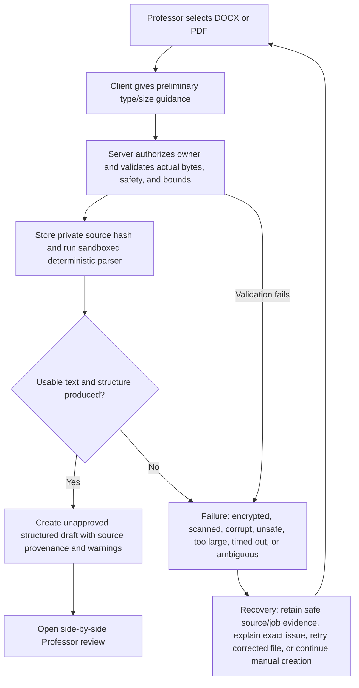
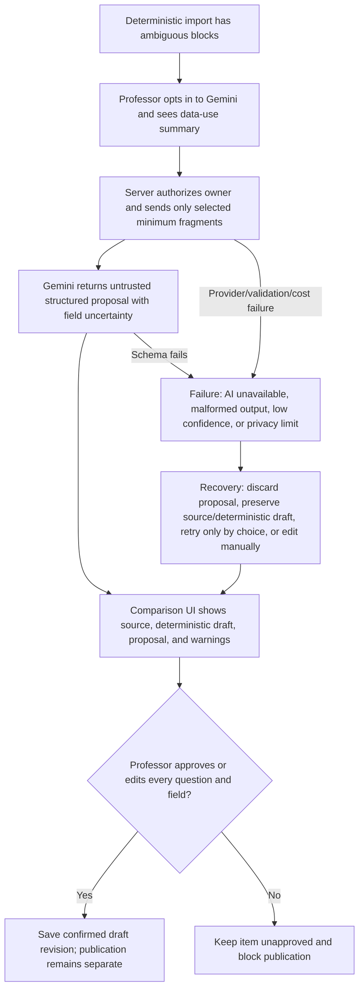

# DOCX, PDF, and Gemini Import

## Product contract

Import accelerates examination creation; it never publishes content or makes the Professor trust an opaque conversion. DOCX and safe text PDF produce a reviewable draft. Gemini may propose normalization and numbering. The Professor compares source and output and explicitly approves every question. Parser or AI failure returns to manual editing with source and completed work intact.

Current repository status: DOCX has useful archive/security validation. PDF is inspected but deliberately returns `manual_required` with no extracted questions. No verified Examination Room Gemini normalization route or Assistant Proctor import implementation exists. Therefore text-PDF import and Gemini-assisted review are target work, not current capabilities.

## Supported launch inputs

| Input | Launch treatment | Bounds / rejection |
|---|---|---|
| `.docx` | Deterministic extraction first; preserve paragraph/list/table order and source locations | Bounded file size, archive entries, uncompressed total, nesting, path length; reject macros, external relationships, encrypted/corrupt archives |
| Text-based `.pdf` | Sandboxed deterministic text extraction with page/coordinate provenance | Bounded file size/page count/object count/decompression/time; reject encrypted, active content, malformed/corrupt, unsafe embedded objects |
| Scanned/image-only PDF | Detect and explain; retain source per policy; manual entry/upload alternative | OCR is deferred; never send to Gemini silently |
| `.txt` where already supported | Deterministic parser and same review contract | UTF/size/question-count limits; no silent character loss |

Recommended initial limits require implementation-phase measurement: ≤25 MB source, ≤150 PDF pages, ≤200 parsed questions hard cap, and ≤100 questions supported launch promise. Limits must be configurable server-side and fail before expensive processing. Do not claim these exact values safe until adversarial parser tests and production-like timing pass.

## Validation and parser pipeline

1. Browser validates extension/declared size for immediate guidance; server repeats all checks using bytes, not MIME alone.
2. Store source privately after owner authorization, malware/content-type checks, and retention classification.
3. Generate source hash and job ID; duplicate retries return the same job/result when appropriate.
4. Sandbox the format-specific parser with CPU/memory/time/output bounds and no network access.
5. Extract ordered blocks with source page/paragraph/table coordinates and warnings.
6. Deterministically identify candidate question boundaries, numbering, subparts, point values, instructions, rubrics/model answers where explicitly labeled.
7. Validate totals, duplicates, missing prompt text, unsupported objects, page gaps, and maximum count.
8. Optionally send minimal ambiguous blocks to Gemini after Professor opt-in.
9. Render source/structured comparison; require per-question approval.
10. Save an owner-scoped draft revision. Publication performs its own validation and never trusts job completion alone.

### Diagram 6 — DOCX/PDF import

## Gemini boundary

Gemini is optional and server-side only. Use a separate production Google Cloud project/key with least privilege, quotas, cost alerts, rotation, audit, retention controls, and an owner. Never place a key in browser code. Never require a second Gmail account merely to create Assistant Proctor.

Allowed input: the minimum ambiguous source blocks necessary for numbering/field structure plus non-sensitive parsing instructions. Disallowed input: credentials, full unrelated class/roster data, active Student answers, grades, other classes, or content not selected by the Professor. Do not use model output to grade, publish, admit, release, or mutate source records.

Allowed output: proposed question boundaries, numbering/subparts, prompt/rubric/model-answer field classification, point-value candidates, and uncertainty. Record provider/model/config, input/source hash, job/correlation ID, timestamps, token/cost estimate, and redacted error—without logging unnecessary exam content.

### Diagram 7 — Gemini normalization and Professor approval

## Comparison and approval UI

The review page has synchronized source and structured panes, with a question outline. Selecting a question highlights its source location. Each field is labeled `From source`, `Professor edited`, or `AI proposed`, and every AI-proposed/uncertain field has an explanation. The Professor can accept a field, edit it, merge/split questions, reorder, mark content as instructions, or reject a proposal.

Question approval is explicit and versioned. Bulk approval is permitted only for purely deterministic, warning-free fields after usability/security review; AI-proposed questions always require individual review. A summary shows unapproved questions, missing point values, total mismatch, duplicate numbering, unsupported content, and source pages not represented.

## Uncertainty policy

Use field-level states: `confirmed_from_source`, `professor_edited`, `ai_proposed`, `uncertain`, `missing`, `unsupported`. Do not present a single confidence percentage as truth. The interface names the reason: ambiguous numbering, merged columns, footnote association, table reading order, probable rubric, missing points, or text not represented. Publication blocks any `ai_proposed`, `uncertain`, `missing required`, or unsafe state.

## Failure and recovery

| Failure | User-visible behavior | Preserved evidence | Recovery |
|---|---|---|---|
| Wrong type/too large/encrypted/unsafe | Reject before parsing with exact limit/reason | Hash/metadata and security audit per retention policy | Correct/export source, reduce size, manual creation |
| Corrupt DOCX/PDF | No partial questions treated as valid | Source/job ID, parser error class | Re-export from Word/PDF tool or manual entry |
| Scanned PDF | `This PDF has no usable text`; no fake success | Source metadata/page detection | Obtain searchable PDF or enter manually; OCR deferred |
| Parser timeout/resource bound | Job failed, draft/source unaffected | Job/runtime/error ID | Retry smaller file or manual entry |
| Partial/ambiguous extraction | Draft opens with warnings; publication blocked | Blocks, provenance, warnings | Professor corrects/approves each item |
| Gemini unavailable/quota/invalid schema | Deterministic draft remains fully usable | AI job/error metadata, no secret | Continue manually or retry later by choice |
| Save conflict during review | Both Professor versions preserved | Revisions, field provenance | Compare/reconcile and save new revision |
| Browser refresh/logout | Return to source and last server-confirmed draft; recover local unsynced edits | Source, server draft, local journal | Reauth, reconcile, resume exact item |

## Security and privacy controls

- Revalidate magic bytes and parse only in a network-isolated sandbox with strict resource/time/output limits.
- Defend against ZIP bombs/path traversal, macros, external relationships, embedded files/scripts, malformed object graphs, decompression bombs, and formula injection in later exports.
- Private object access is short-lived and owner scoped; source URLs never become public exam links.
- Encrypt at rest/in transit using platform controls; define source/draft/artifact retention and deletion separately.
- Sanitize all extracted display, strip active markup, and never execute document content.
- Prevent cross-owner job lookup and indirect object-reference access; audit reads/downloads.
- Gemini processing requires approved provider terms/data region/retention, minimum payload, opt-in, and no model training where contractually applicable.

## Required tests

### Parser/security

Golden DOCX/PDF fixtures: headings, numbered lists, tables, footnotes, Unicode/legal citations, long prompts, subparts, points, instructions, rubrics, 100-question launch and 200-question cap. Adversarial fixtures: renamed MIME, corrupt archive/xref, encrypted PDF, macro DOCM, external relationship, path traversal, ZIP/decompression bomb, embedded JavaScript/file, huge object graph, malformed fonts, image-only scan, mixed scan/text, blank pages, duplicated numbering, and timeout.

### Functional/integration

Browser → upload → owner authorization → private source → job → parser → draft revision → comparison → approval → publication validation. Test retry/idempotency, refresh/logout, concurrent Professor edit conflict, expired object URL, deleted source policy, and Gemini disabled/unavailable/malformed/quota. Assert no parser/AI completion changes publication state.

### Human/accessibility

Professors of varied technical ability import real law-exam DOCX and text PDFs, correct ambiguous numbering, find every unrepresented page, understand AI versus source, decline Gemini, recover from failure, and publish only after review. Keyboard/screen-reader users must operate synchronized panes without loss of source context. Repeat each critical format/failure at least five times.

### Acceptance

Valid DOCX and bounded text PDF create complete review drafts; scanned PDF fails honestly; every field is traceable to source/Professor/AI; Gemini failure cannot block manual completion; no unsafe file executes or crosses owners; no unapproved question can publish; 100% test artifacts and previews open; and source/draft work survives refresh and retry.
