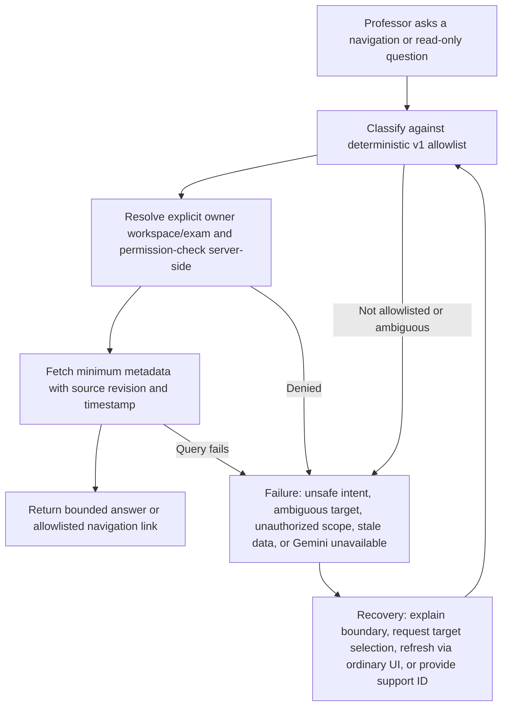
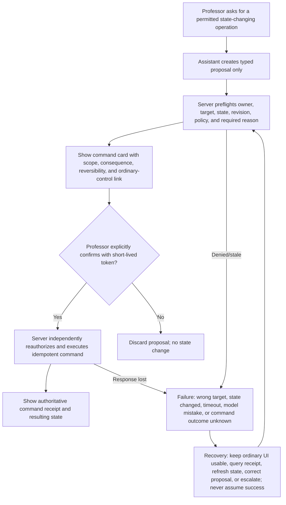

# Assistant Proctor Specification

## Definition

**Assistant Proctor** is a Professor-facing side inbox and command assistant. It helps the Professor navigate, find operational information, understand the current page, and prepare narrowly scoped commands. It is not a Student answer assistant, a Beadle replacement with extra privilege, a grader, or an autonomous operator.

Assistant Proctor has no direct database credentials. It may call only allowlisted server functions under the Professor's authenticated identity. The server repeats ownership, role, state, scope, revision, and confirmation checks. Ordinary buttons/navigation remain available for every action; Gemini or Assistant Proctor failure cannot block the Examination Room.

## Placement and inbox behavior

Open from the Professor workspace header and grading header. On desktop it is a 360–420px right-side inbox that does not cover the primary action; on compact screens it is a focus-trapped full-screen drawer. It never appears in Student answer pages.

Initial view:

### What you can do

- Navigate to an allowed Professor page.
- Explain the current page, visible status, and next safe action.
- Find a candidate by exact/partial identity within the current owned examination.
- Summarize metadata-only room status and candidates needing attention.
- Show early submissions, failed notification jobs, failed file jobs, and recent incidents.
- Open the ordinary control for a permitted intervention.
- Draft feedback text when the Professor explicitly supplies/opens the relevant submitted answer and policy permits; never save or grade automatically.

### Quick actions

`Open examination creation`, `Show candidates needing attention`, `Show early submissions`, `Explain this page`, `Find a Student`, `Show failed notifications`, and `Show failed downloads` are permission-aware. Hidden/unavailable actions explain the boundary without revealing protected data.

Each answer shows the examination scope, source/last-confirmed timestamp, and whether it is read-only information or a proposed action. Conversation history follows retention/privacy policy and is not an audit substitute.

## Version-one allowlist

| Class | Allowed function | Data boundary | Result |
|---|---|---|---|
| Navigation | Open dashboard/create/import/review/publish/monitor/grading/results/files/support within current owner scope | Allowlisted route and identifiers only | Client navigation; no domain mutation |
| Explanation | Explain visible page, plain-language status, required fields, recovery option | Current UI state plus approved product help | Read-only response |
| Find | Find candidate or exam within Professor-owned current workspace | Identity/status metadata; no active answer text | Bounded matches and links |
| Room summary | Counts of waiting/active/offline/submitted/needs-attention | Metadata-only aggregate | Timestamped read-only summary |
| Candidate operations summary | Identity/timing/session/sync/receipt metadata for selected candidate | No answer text unless grading an eligible submitted generation | Timestamped read-only summary |
| Job summary | Failed/pending email/export jobs and retry eligibility | Redacted recipient/artifact metadata | Timestamped read-only summary |
| Grading navigation | Open early-submitted candidate or question anchor | Only submitted/sealed owned generation | Navigation; never a mark |
| Draft feedback | Draft prose from Professor-selected submitted answer/rubric | Minimum selected content, opt-in, no save | Untrusted text inserted only after Professor chooses |
| Proposed intervention | Prepare pause/resume/extension/reopen/session-transfer command card | Target metadata and current revision | No mutation until ordinary server confirmation flow |

Excluded from v1: create an entire exam from an unreviewed prompt; roster bulk mutation; autonomous admission; answer editing; mark/total calculation as authoritative; grading/finalization; result release/amendment; archive/cancel/end; autonomous retry that changes recipients; Admin break-glass; cross-class analytics; continuous camera/microphone analysis.

## Permission and data checks

Every function call requires authenticated Professor session, active owner membership, explicit current workspace/exam, allowlisted function, candidate/publication/submission version where relevant, and current server permission. Never trust IDs inferred by the model. Resolve a human name to bounded candidates and ask the Professor to choose if ambiguous. Strip prompt-injection-like document/answer content from the control channel; treat all source content as data, not instructions.

Gemini receives only the minimum data for the requested operation. Navigation/explanation should be deterministic where possible and not require Gemini. Active Student answer text, other classes, grades, model answers, credentials, secrets, and Admin data are unavailable. Submitted answer/rubric fragments may be used only for explicit Professor-requested feedback drafting under approved privacy terms.

## Three confirmation classes

1. **Read-only**: navigation, explanation, owner-scoped counts/status. Execute after permission check; show timestamp/source and refresh option.
2. **Reversible/low-impact proposal**: opening a prefilled ordinary form or drafting unsaved feedback. Show what is proposed; Professor applies or discards it in the ordinary UI.
3. **State-changing/high impact**: pause/resume, extension, reopen, session transfer, future publish/release/amend/cancel. Assistant Proctor may prepare a command card only. The Professor must review scope/consequence/reason and confirm through a server-issued, short-lived confirmation token. Release, grading/finalization, amendment, cancel/end, and Admin break-glass remain ordinary UI-only in v1.

## Read-only command flow

### Diagram 27 — Assistant Proctor read-only command

## Confirmed command flow

### Diagram 28 — Assistant Proctor confirmed command

## Function-call security

- Define closed JSON schemas with no arbitrary route, SQL, URL, recipient, or RPC name.
- Server derives actor/owner from session, not model arguments.
- Validate target IDs against the current owner scope and current state/revision.
- Use per-function rate/size/time bounds; reject extra fields and indirect prompt instructions.
- Require idempotency and a confirmation token bound to actor, target, command, parameters, expected revision, expiry, and displayed consequence.
- Never expose service-role or Gemini credentials to the browser/model output.
- Sanitize output and source citations; no raw stack traces, provider secrets, or other-user existence leaks.
- Add cross-owner, confused-deputy, prompt-injection, replay, expired-token, stale-revision, and mass-target tests.

## Failure behavior and recovery

| Failure | Required behavior |
|---|---|
| Gemini/model unavailable | Deterministic quick actions and ordinary UI continue; show retry without blocking |
| Intent not in allowlist | State boundary plainly; link to safe ordinary control if one exists |
| Ambiguous Professor/candidate/exam | Show bounded choices; never guess or reveal outside scope |
| Permission denied | Do not reveal protected record; explain only the permitted next step |
| Stale data/revision | Refresh server state and regenerate proposal; old confirmation invalid |
| Invalid/malformed model function | Reject server-side, log redacted failure, no execution |
| Command timeout | Mark outcome unknown, query receipt, disable blind repeat |
| Partial UI failure after confirmed command | Restore from authoritative state/receipt; no compensating mutation unless separately authorized |
| Bad drafted feedback | Professor edits/discards; no saved grade was changed |
| Repeated failures | Circuit-break Assistant Proctor only; ordinary controls and active attempts remain available |

## Logging and privacy

Log actor, owner/exam scope, user request category/redacted text, function classification, target refs, permission decision, proposal hash, confirmation token ID (not secret), command receipt, model/config, latency/cost, outcome, and failure class. Do not copy entire answer/exam content into general logs. Apply retention and access rules separately to conversation, AI job, domain audit, and security logs.

The Professor can view recent Assistant Proctor activity and which commands actually changed state. A model response is never evidence of a mutation; only the server command receipt is.

## Fallback and availability

Every function has an ordinary button/navigation equivalent. If Assistant Proctor or Gemini is degraded, hide/disable only the assistant entry, preserve current page/input, and expose status/support ID. Active attempts, save, submission, monitoring, grading, portal release, email retry, and files cannot depend on it.

## Required tests and acceptance

- Unit/schema tests for every allowlisted function, disallowed intent, malformed/extra fields, and confirmation class.
- Authorization tests for owner/non-owner, optional Beadle, Student, revoked member, other class, active versus submitted answer, and Admin.
- Replay/stale/timeout/idempotency tests prove a model cannot double-apply a command.
- Prompt-injection fixtures in DOCX/PDF/questions/answers cannot alter the control channel.
- Browser tests prove ordinary UI parity and unchanged work when the assistant fails mid-request.
- Load/cost tests cover request bursts without degrading active-exam APIs.
- Human Professors complete read-only, ambiguous, denied, confirmed, failed, and recovery tasks and correctly identify whether state changed.

Release requires permission-checked read-only commands, allowlisted navigation, confirmation for every mutation, no permission bypass, no cross-Professor access, no autonomous grade/release, and a fully functional ordinary UI with Gemini disabled.
