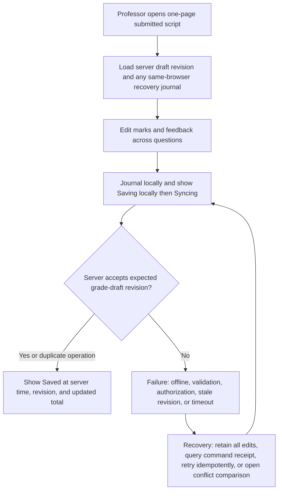
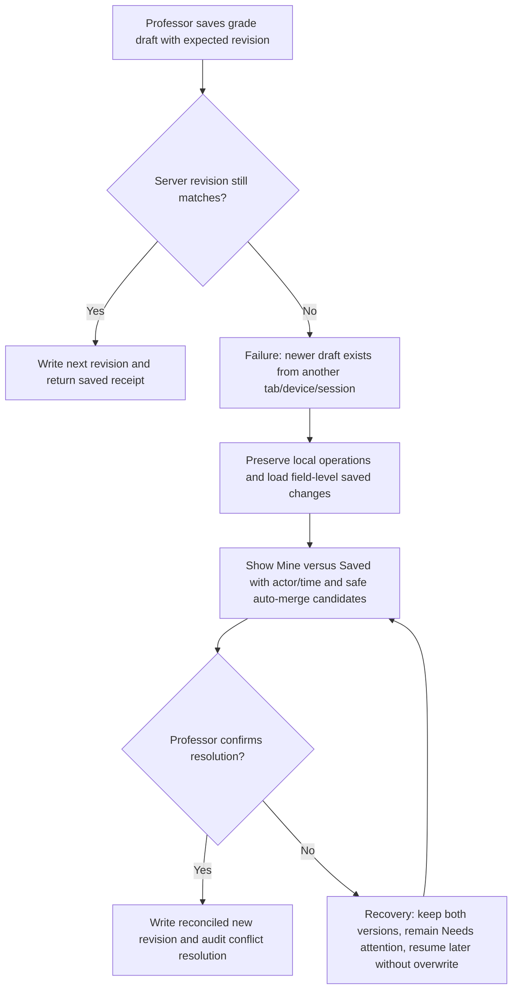
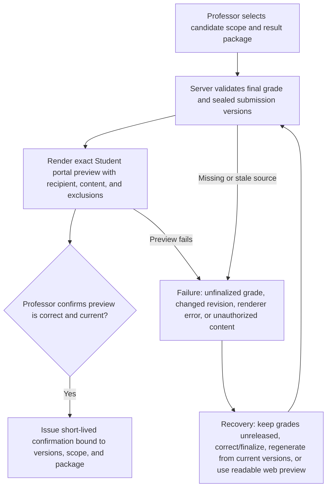
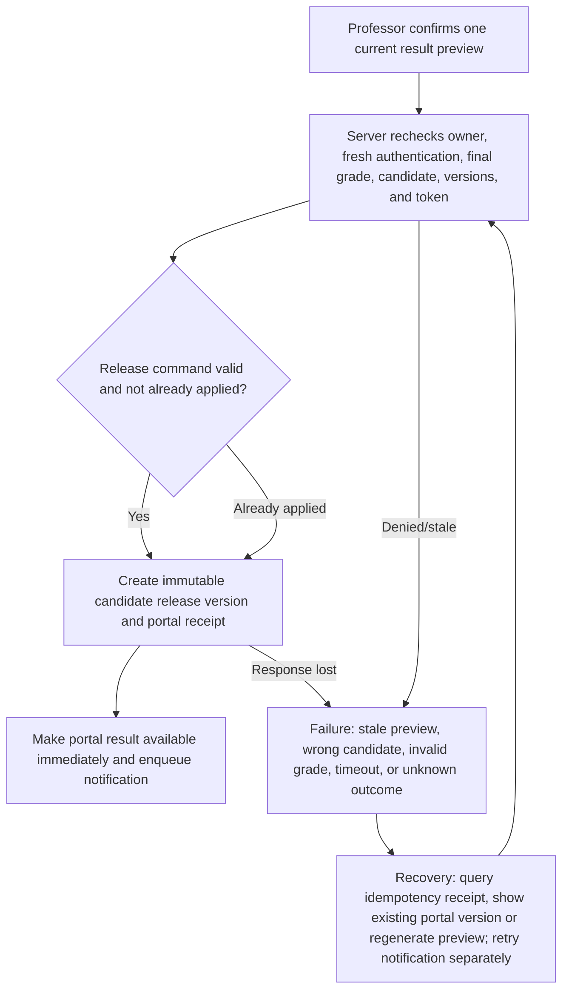
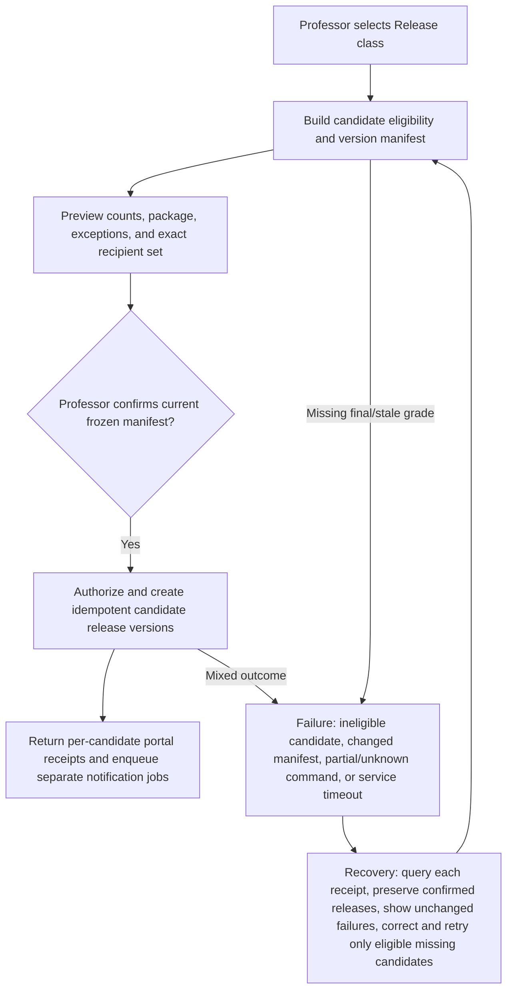
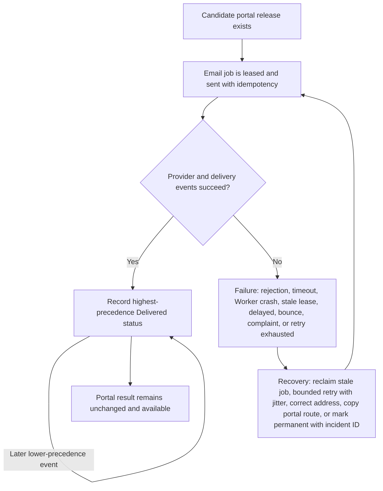
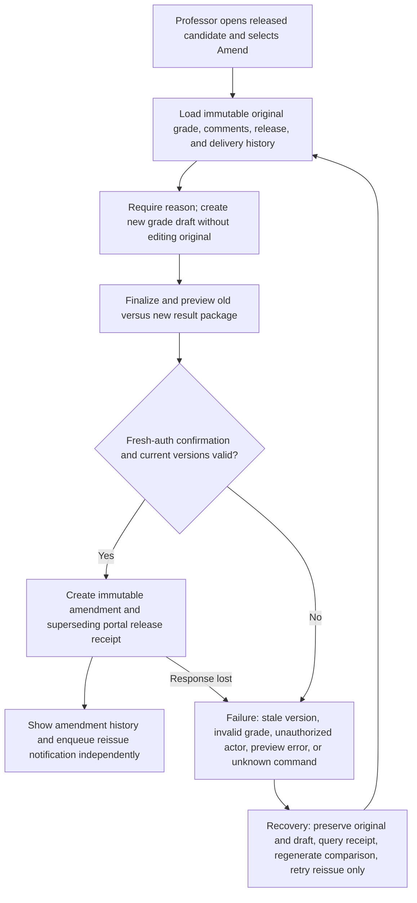

# Grading and Result Release

## Product contract

Grading is Professor-owned, revisioned, resumable, and separate from result release. A submitted candidate can be graded while classmates remain active. One-page Student grading is default; question-by-question is optional. A visible server-confirmed save—not a browser draft or downloaded file—is authoritative. Release creates an immutable portal version first; notification follows independently. Corrections create amendments, never overwrites.

## Eligibility and early grading

Only a submitted, auto-submitted, or otherwise sealed submission generation enters the grading queue. The queue shows candidate identity, receipt, submitted time/method, grading status, last saved time/revision, total, and release status. It never reveals answer text for active attempts. Filters include Early submissions, Ungraded, In progress, Final, Released, and Needs attention.

### Diagram 19 — Early grading

```mermaid
flowchart TD
    A[Student receives sealed submission receipt] --> B[Candidate enters Professor grading queue while class may remain open]
    B --> C[Professor opens exact submission generation]
    C --> D[Server verifies owner and sealed status; active peers remain metadata-only]
    D --> E[Create or return revisioned grade draft]
    E --> G[Professor grades without changing examination open state]
    C -->|Wrong/stale generation| F[Failure: submission not sealed, reopened, unauthorized, or query unavailable]
    D -->|Denied| F
    F --> R[Recovery: refresh receipt/generation, wait for seal, use new reopened submission, or escalate with support ID]
    R --> C
```

## One-page grading — default

The page contains the selected Student's full submitted script in order. Each question unit includes Times New Roman prompt and submitted answer, permitted rubric/model answer, point maximum, mark, and Professor feedback. A sticky outline, Previous/Next Student, total, Assistant Proctor, and save status reduce scrolling uncertainty. Large scripts may render incrementally, but find, focus, totals, and drafts remain stable.

The draft is one logical object regardless of view mode. Switching to Question mode changes presentation only. Model answers and rubrics are Professor-only until the chosen result package permits them. The grading page never requires Beadle or grading key; owner authentication plus recent step-up is used for release/amendment.

### Diagram 20 — One-page grading save



## Save states and navigation safety

| State | Trigger | Professor-visible text | Navigation rule |
|---|---|---|---|
| Editing | Current value differs from local journal | `Editing` | May remain; leaving triggers immediate journal |
| Saving locally | Durable browser write pending | `Saving on this device…` | Do not close silently |
| Syncing | Server operation outstanding | `Syncing with Examination Room…` | Navigation allowed if journal is durable; status persists |
| Saved | Server acknowledges visible revision | `Saved at 10:42:18` | Safe to navigate/logout/device return |
| Needs attention | Conflict/auth/policy/repeated failure | `Needs attention — your edits are preserved` | Identify affected fields; do not finalize/release |

Autosave may coexist with an explicit `Save now` control, but both use the same idempotent revision contract. Do not require a reason for ordinary draft saves. A reason is required when changing a finalized or released grade.

## Question-by-question mode — optional

Question mode provides a split view and candidate/question navigation for Professors who prefer comparative marking. It reads/writes the exact same grade draft IDs, field operation IDs, totals, and server revision as one-page mode. Mode switches, refresh, and device return cannot clone or discard draft data. Each question displays the Student/submission context to prevent marking the wrong script.

## Grade conflict

A stale write cannot overwrite a newer grade draft. The server returns base/current revisions and field-level changes. The UI preserves the local version and shows Mine, Saved version, and an editable resolution. Non-overlapping changes may be merged deterministically; overlapping marks/feedback require Professor choice. Resolution writes a new revision and audit event.

### Diagram 21 — Grade conflict



## Finalization

`Finalize grade` validates every required mark, total, policy range, and feedback requirement; shows the exact Student/submission generation; and creates an immutable grade version. It does not release anything. The Professor may create a new draft from a final version before release under ordinary grade-correction policy; after release, amendment rules apply. Batch finalization is deferred unless comprehension and error-recovery testing proves it safe.

## Result packages and preview

Required standard packages:

1. **Score only** — total/maximum and grade label where configured.
2. **Score + feedback** — score plus overall/per-question Professor comments.
3. **Full marked script** — score, feedback, questions, submitted answers, and only the model answers/rubrics the Professor intentionally permits.

The package selection is release-versioned per candidate or batch. Preview runs from the final grade version, sealed submission, publication version, and package policy—not live browser form state. It shows the named recipient and exact web/PDF representation. If any source revision changes, the preview becomes stale and confirmation is blocked.

### Diagram 22 — Result preview



## Individual and selected release

Individual release is appropriate for early grading or a correction schedule. The confirmation names the Student, package, grade version, immediate portal effect, and separate notification. An idempotent release command creates/returns one immutable candidate release version. Selected release uses the same per-candidate receipts and reports mixed outcomes without pretending an atomic all-success result when policy/implementation is not atomic.

### Diagram 23 — Individual release



## Whole-class release

Whole-class release first summarizes eligible, ineligible, already released, and changed-since-preview candidates. The Professor can exclude ineligible/attention items or return to grading. Confirmation binds a frozen eligible set and package policy. The response lists a receipt for every candidate; portal availability is independent of email burst success.

### Diagram 24 — Class release



## Portal-first notification and retry

Portal release is successful when the candidate release version exists and is authorized for that Student. Email status can be Not queued, Queued, Processing, Provider accepted, Sent, Delivered, Delayed, Failed, Retrying, Permanently failed—always alongside `Portal available`. Provider precedence prevents Delivered from regressing to Sent/Delayed; bounce/complaint remains visible.

Professor may retry an eligible job or correct an address after viewing the consequence. Retry reuses the release version and creates/updates notification job attempts only. Copy portal link/instructions and approved alternate contact remain available.

### Diagram 25 — Failed email and retry



## Post-release amendment and reissue

The Professor selects `Amend released result`, sees original grade/comments/release time/delivery history, enters a reason, creates a new draft, finalizes it, and previews old versus new. Fresh authentication and explicit confirmation create an immutable amendment/release version that supersedes the old one. The Student portal labels the latest version and amendment time/reason summary as policy allows. Reissue notification is a separate job.

### Diagram 26 — Post-release grade amendment



## Downloads in grading/results

Files are read-only jobs against named server-confirmed revisions. If unsynced browser edits exist, explain that the export uses the last server-saved version and offer `Save now` or `Continue with saved version`; do not disable grading or mutate its state. Completion validates MIME/signature/name/content/privacy and real application opening. Failure offers readable web view, browser print, regenerate, and incident ID.

## Authorization and privacy

- Owner-only grade access; optional delegates/Beadles cannot see answers/grades/releases.
- Active answers are excluded from grading and monitoring payloads.
- Recent reauthentication/MFA is required for release/amendment, not a reusable grading key.
- Candidate release queries bind signed-in Student to exactly their release versions.
- Exports/packages include only selected candidates and approved content; neutralize spreadsheet formula injection and preserve leading-zero IDs.
- Assistant Proctor may navigate/read eligible metadata or draft unsaved feedback by explicit request; it cannot save marks, finalize, release, or amend.

## Acceptance

An uncoached Professor grades an early submitter while the class remains open, completes a full script on one page, switches modes without loss, understands every save state, recovers from refresh/device conflict, finalizes separately from release, previews the exact Student package, releases one and a class, continues during email failure, downloads files without affecting grading, and amends/reissues with complete immutable history.
