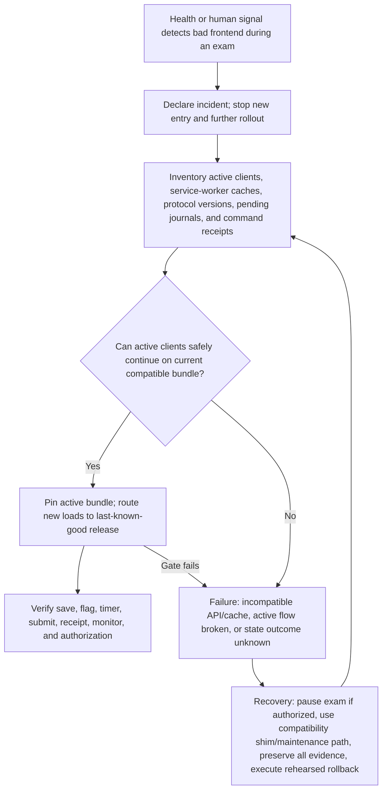

# Failure Recovery and Incident Matrix

## Operating rule

Failures must be explicit, bounded, and recoverable. Preserve authoritative records and device-local evidence; never claim success after an ambiguous response; never make a supporting job change domain state. User messages describe what is safe and what to do next. Support uses IDs and metadata before any protected content.

## Severity and response

| Severity | Definition | Immediate control | Owner |
|---|---|---|---|
| P0 | Active answer/submission loss, authorization/privacy breach, class-wide inability to proceed, corrupt state | Stop new entry/deployments; preserve active clients/data; incident bridge and rollback decision | Wally/Admin incident lead + independent technical lead |
| P1 | Major core degradation with bounded safe recovery, or result/grade integrity risk | Isolate feature/job, inform Professor, use audited recovery | Wally/Admin + Professor |
| P2 | Isolated file/email/AI failure while portal/core flow works | Retry/fallback with incident ID | Professor/support within scoped permissions |
| P3 | Guidance/cosmetic issue without data/action risk | Document/work around; backlog | Product/support |

Target recovery objectives are policy proposals requiring owner approval: no confirmed answer/flag/grade/submission/release loss (RPO 0 for acknowledged domain data); local unconfirmed edits retained until resolved; P0 acknowledgement ≤5 minutes during a supported live exam; safe pause/entry control ≤10 minutes; job retry visibility ≤15 minutes. Do not market an SLA until staffing and evidence support it.

## Required emergency scenarios

| ID / scenario | User-visible message | Automatic behavior | Manual recovery / allowed actor | Audit and preserved data | Must never be lost | Test / retry or rollback |
|---|---|---|---|---|---|---|
| I01 Professor closes browser | Return dashboard shows last server save and recoverable local edits | Server state unchanged; local journal retained | Professor signs in and reconciles; support IDs only | Auth return, draft revisions, journal status | Confirmed grade/exam work; unsynced local evidence | Browser kill/reopen on same/new device ×5 |
| I02 Student closes browser | `Your confirmed work is safe`; identify device-only pending items on return | Attempt/timer continue by policy; journal retained | Student reopens/signs in; Professor only if session recovery needed | Session close/rejoin, answer/flag ops | Confirmed answers/flags and pending journal | Hard close at each save state; reopen ×5 |
| I03 Internet disconnects | `Offline — saved on this device`; exact pending count | Journal locally; queue ordered ops; server timer remains authoritative | Automatic reconnect; Professor scoped recovery if deadline/session rejects | Offline/reconnect events, op IDs/revisions | Typed text/flags and original timestamps | Network cut, late reconnect, conflicting device |
| I04 Worker fails | `Service temporarily unavailable; do not clear browser data` | Local journals continue; queues lease/retry; circuit breaker | Admin restore/rollback compatible Worker; Professor may pause | Worker/version/command/job receipts | Browser evidence, DB state, submission intents | Crash before/after DB commit and response |
| I05 Database times out | `Status unknown — checking receipt`; no false save/submit | Do not blind retry mutation; query idempotency/receipt | Automatic bounded retry; Admin diagnostics metadata-only | Command ID, timeout, DB/Worker correlation | Last confirmed revision and pending op | Timeout before/after commit, recovery query |
| I06 Gemini fails | `Assistant unavailable; continue normally` | AI job fails independently; no draft/domain mutation | Professor uses deterministic/manual UI; retry by choice | AI job/model/error metadata | Source, deterministic draft, Professor edits | Disable/quota/malformed/timeout fixtures |
| I07 Email fails | `Portal available; notification needs attention` | Queue retries/reclaims; release unchanged | Professor retry/correct/copy link; Admin provider diagnostics | Release receipt, job attempts/events | Portal release and delivery history | Provider reject/crash/bounce/replay |
| I08 PDF generation fails | `File could not be generated`; web result remains | Export job fails only | Professor browser-print/regenerate; Admin renderer diagnostics | Source revision, job/renderer/error | Exam/grade/release state | Renderer crash, long/Unicode, open validation |
| I09 Excel generation fails | Same as PDF plus no unsafe partial workbook | Export job fails/quarantines invalid artifact | Regenerate or CSV/web fallback if approved | Snapshot/job/schema/error | Leading-zero IDs, privacy, grade state | Formula injection, large class, open in Excel |
| I10 Student uses two devices | Second device is read-only; active device identified | Enforce one writer lease | Student requests transfer; Professor/Admin resolves conflicts scoped to candidate | Leases, operations, revocation/transfer receipt | Both copies and confirmed server revision | Concurrent tabs/devices, unreachable old device |
| I11 Student loses device | New device shows confirmed work and transfer path | Old lease remains until expiry/revocation; pending unknown flagged | Student reauth; Professor authorizes scoped session recovery | Session/identity/transfer events | Server-confirmed work; old receipt/evidence | Loss while synced and with pending local ops |
| I12 Student submits accidentally | Receipt and locked state; explain reopen policy | Submission remains immutable | Professor may reopen with reason/new generation before prohibited downstream state | Old receipt, reopen link/reason | Original sealed submission | Reopen before/after grade/release guards |
| I13 Professor saves wrong score | Saved revision/history visible | No silent overwrite | Professor edits new draft/version; reason after final | Grade revisions/actor/time | Previous score/comments | Draft correction, finalized correction conflict |
| I14 Professor releases wrong grade | Portal shows release version; amendment path | Do not retract/delete silently | Professor amends with reason/fresh auth and reissues | Original/new grade, releases, delivery | Original grade/comments/time/history | Wrong individual/class grade amendment |
| I15 Bad frontend deploy | Visible degraded/outdated notice if detected; preserve work | Stop new entry; active protocol-compatible clients continue | Admin route new loads to previous build; Professor may pause | Asset/Worker/SW versions, incident timeline | IndexedDB journals, active sessions, DB revisions | Diagram 33 plus mixed-version browser test |
| I16 Service worker activates mid-exam | No forced reload; `Update available after exam` | Pin active bundle/cache protocol; defer activation | Admin rollback/correct cache; Student finishes on compatible client | SW/cache/client version events | Current UI, local journal, session | Waiting SW, activation/reload/offline cache test |
| I17 Entire class submits simultaneously | Per-Student `Submitting` then receipt/attention | Idempotent queue/DB path; backpressure without duplicate | Automatic retry/query; Professor sees aggregate status, not answer text | Latency, receipts, failures, DB contention | Every sealed answer set and receipt | 1/20/50/100/200/500 burst tests |
| I18 Entire class reconnects simultaneously | `Reconnecting; work remains on device` | Jitter/backoff, ordered idempotent sync, shared-NAT-safe limits | Automatic; Professor pauses only if service health warrants | Op outcomes, rate limits, latency | Pending operations/order | Shared NAT 200 supported, 500 stress |
| I19 Professor cancels | Scope/consequence and active-attempt warning | No deletion; prevent new entry only after authorized command | Professor confirms reason; Admin only scoped emergency policy | Publication/attempts/cancel command/notice jobs | All attempts, receipts, audit | Draft/pre-open/active cancellation branches |
| I20 School requests audit evidence | Explain available manifest and authorization | Read-only export job against immutable refs | Professor/authorized Admin generates scoped manifest | Audit access/export event | Source histories and access trace | Authorization/privacy/file-open audit export |

## Additional release-critical failures

| ID / scenario | Automatic containment | Recovery and allowed actor | Evidence / test |
|---|---|---|---|
| I21 Flag sync fails | Keep local flagged state and mark pending; never clear on refresh | Automatic replay/reconcile; Student/Professor sees affected question/status | Flag ops/revisions; offline/epoch/device regression |
| I22 Answer revision conflict | Preserve both; block silent overwrite | Student selects only when safe or Professor handles scoped recovery under policy | Both hashes/revisions/actors; concurrency tests |
| I23 Grade draft conflict | Preserve both; `Needs attention`; block finalize | Professor field-level reconcile | Grade revisions/merge receipt; multi-tab/device tests |
| I24 Submission response is lost | Keep submission intent, stop new edits, query receipt | Automatic idempotent status query; Professor sees stuck intent metadata | Intent/receipt/generation; lost-response test |
| I25 Auto-submit fails at zero | Persist auto-submit intent and sealed local evidence | Retry/query; Professor sees incident and may use policy-defined recovery | Timer/server time/intent; offline-at-zero test |
| I26 Identity is ambiguous/duplicate | Do not create two candidates or leak roster | Professor resolves identity with audit; Student retries | Match candidates redacted; collision tests |
| I27 Roster upload has duplicates/errors | Block publication/admission for affected entries | Professor corrects review report; retain draft roster version | Validation report/version; realistic roster fixture |
| I28 DOCX is unsafe/corrupt | Reject sandbox parse; no partial valid draft | Professor corrects/re-exports/manual entry | Source hash/error; adversarial parser tests |
| I29 PDF is scanned/encrypted/corrupt | Honest `manual required`, no fake import | Searchable re-export/manual creation; OCR deferred | Page/type detection; fixture tests |
| I30 Publication times out | Treat outcome unknown; no duplicate version | Query by command ID; return receipt or exact validation | Publication version/command receipt; commit-response loss |
| I31 Pause/extension/reopen times out | Do not assume; display last confirmed state | Query receipt; retry only missing target(s) | Timing ledger/receipts; mixed batch tests |
| I32 Notification event arrives out of order | Apply precedence, preserve raw event | Automatic recomputation; Admin investigates signature/provider | Provider event history; replay/reorder test |
| I33 Export is blank/corrupt | Fail semantic/open validation; quarantine | Regenerate/readable web/browser print | Artifact hash/renderer version/error; application-open matrix |
| I34 Authorization/cross-owner attempt | Deny without existence leak; rate-limit | Security incident workflow; revoke session/credentials as scoped | Immutable security event; ownership/IDOR tests |
| I35 Assistant Proctor proposes wrong command | Proposal has no authority; confirmation bound to exact target | Professor discards/edits/uses ordinary UI | Proposal hash/decision; prompt injection/ambiguity tests |
| I36 Assistant Proctor command outcome unknown | Disable blind repeat; query server receipt | Refresh/retry idempotently or ordinary UI | Function/confirmation/command IDs; lost response test |
| I37 Monitor snapshot is stale | Label timestamp/stale; disable unsafe action based on it | Refresh and re-preflight command server-side | Snapshot/revision; delayed network test |
| I38 Result preview/render fails | Release blocked; grades remain final/unreleased | Regenerate web preview; fix package/data | Preview source refs/error; long/Unicode/privacy test |
| I39 Partial class release | Preserve successful candidate releases; no false all-success | Query per-candidate receipts, correct and retry only missing | Batch manifest/results; mixed validity/timeout test |
| I40 Account/session revoked mid-task | Local evidence preserved; server denies new mutations | Reauth/owner membership repair; scoped transfer | Auth events/revisions; revocation across save/submit/grade |
| I41 Storage quota/private object unavailable | Core exam continues; source/artifact job fails only | Retry storage or regenerate from authoritative snapshot | Job/source refs; quota/outage test |
| I42 Clock skew/client timer drift | Server time/deadline wins; explain correction | Resync clock; Professor timing ledger/extension if justified | Client/server timestamps; ±skew/timezone/DST tests |

### Diagram 33 — Bad frontend deployment

## Admin recovery boundary

Wally/Admin may inspect version health, counts, timings, queue/export/command status, and redacted errors; retry eligible jobs; stop new entry; route traffic to a known-good compatible release; revoke compromised access; and perform candidate-specific break-glass only with fresh MFA, reason, time limit, immutable audit, and independent review. Admin may not silently read all answers, act as co-Professor, change a score, release a result, erase a receipt, or bypass ownership because a service-role credential exists.

## Incident record and communication

Every P0/P1 record includes incident ID, start/detect/acknowledge/contain/recover times, affected versions/exams/candidates, user-visible symptoms, domain invariants checked, command/job receipts, data preserved/lost (`none` unless proven), decisions/actors, communications, rollback/retry, validation, and follow-up regressions. Updates state current impact and safe user action; avoid unsupported certainty.

## Recovery completion rule

An incident is not resolved when the page reloads. Resolve only after authoritative revisions/receipts reconcile, pending local operations are accounted for, affected users can continue or have an approved alternative, security/privacy impact is assessed, files/notifications are independently retried if relevant, regression tests exist, and an independent reviewer accepts the evidence.
