# Examination Room open-access audit

Date: 2026-08-27 (Asia/Manila)

Production audited: `https://duediligence.ph`

Candidate audited: `http://127.0.0.1:4174`

Requested test recipient: redacted from generated evidence

## Verdict

- **Production: FAIL.** The deployed site still serves the older Professor-role gate, omits the requested Examination Room shortcut beside the signed-in role control, and does not expose the real Examination Room owner command center.
- **Current candidate: PASS locally.** The candidate allows every signed-in account to create, save, publish, and request a key. Admin approval generates the student key and unlocks Monitoring and Grading for the creator without creator key entry.
- **Deployment: BLOCKED, not attempted.** Cloudflare R2 is not enabled for the account (Cloudflare API code `10042`), and the repository has neither `EXAMINATION_ROOM_STAGING_DATABASE_URL` nor `EXAMINATION_ROOM_PRODUCTION_DATABASE_URL`. Deploying only the frontend would expose the new client against an old Worker and unmigrated database, so it was not done.
- **Real email: NOT SENT.** No real provider acceptance ID exists. Email templates, batching, idempotency, durable result-delivery records, and all five Examination Room email paths passed through an injected mock provider only.

## Numbered audit journey

### 1. Production header and menu — FAIL

The signed-in production header shows the Admin role control but no Examination Room control beside it.

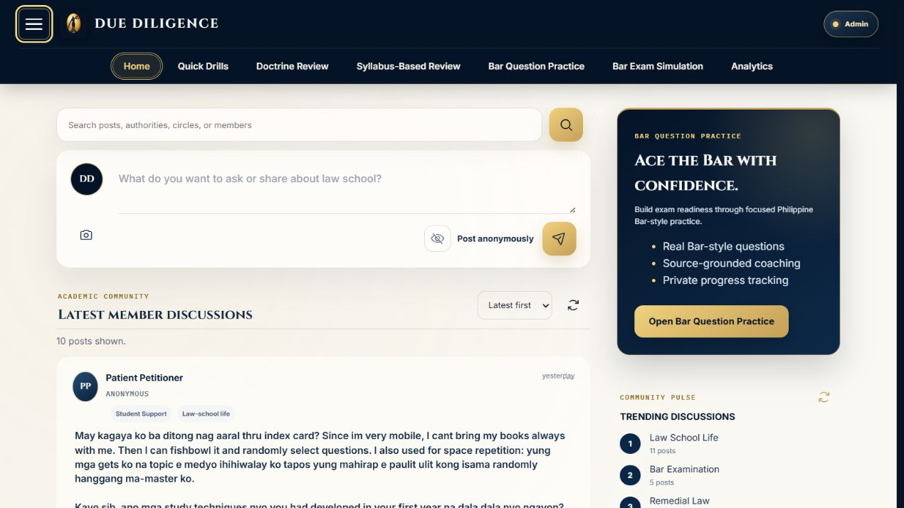

### 2. Production Professor door — FAIL

The production door still says `ASSIGNMENT REQUIRED` and disables Professor access. Direct navigation also reports that Professor access has not been granted. This reproduces the user-reported failure.

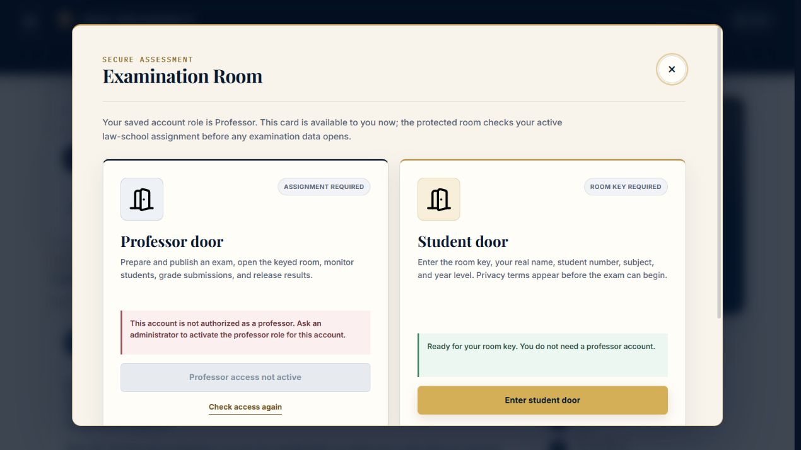

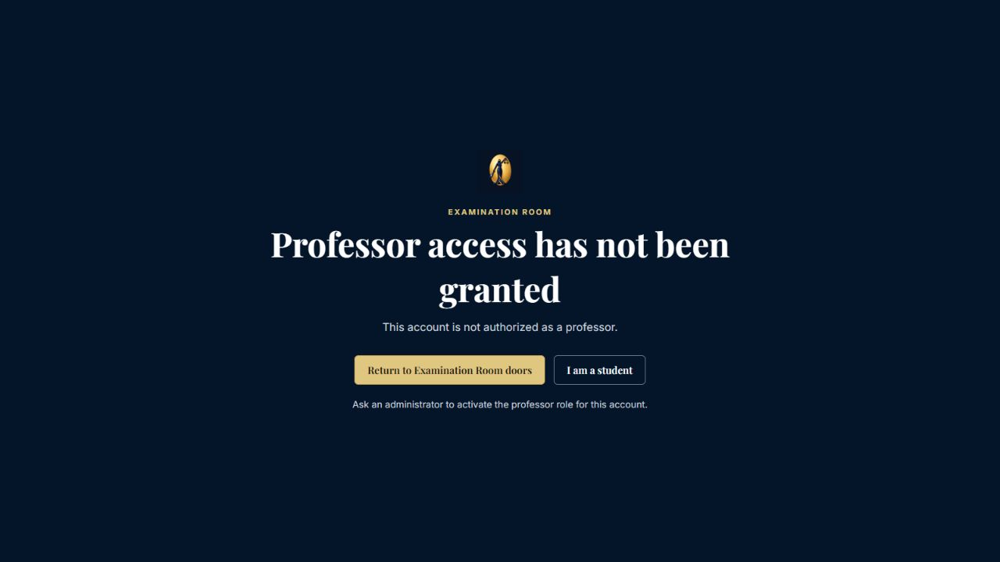

### 3. Candidate creator entry — PASS locally

The current candidate opens the creator workspace for a signed-in account without a Professor profile category, license declaration, staff assignment, roster, or pre-issued key. The default admission mode remains `Anyone with the student key`; real-name grading remains the default, with anonymous grading optional.

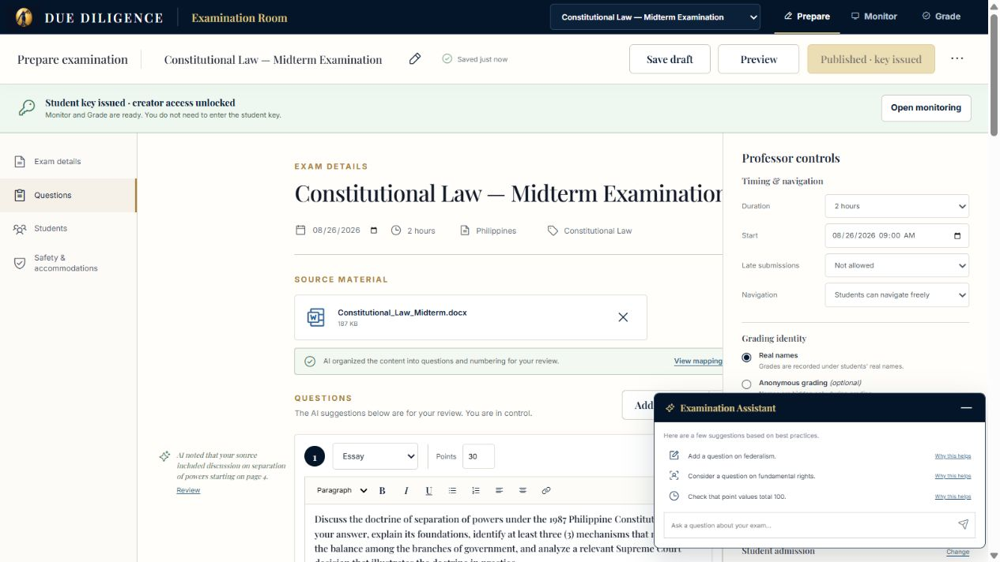

### 4. Creator to Admin to automatic unlock — PASS locally

An actual browser journey created `Open Access Live Audit Examination`, entered a Constitutional Law essay question, assigned 100 points, selected the default no-roster mode, saved the draft, published it, and sent the key request. Admin Refresh displayed the request immediately. One click on `Approve & generate key` activated the room. The creator page then showed enabled Monitor and Grade controls without asking the creator for the student key.

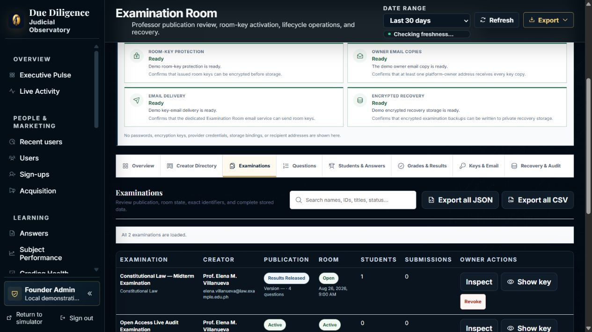

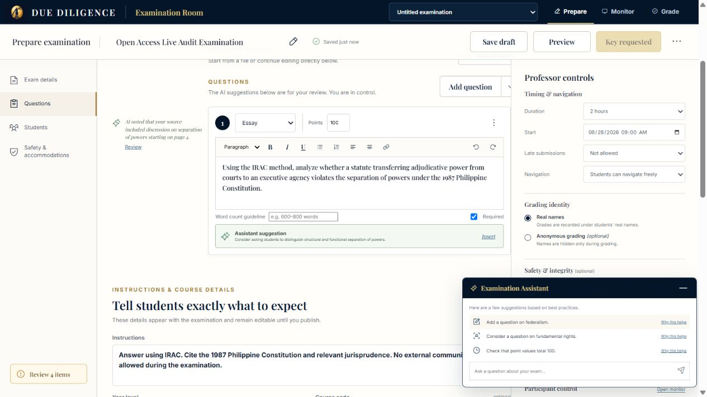

### 5. Student entry, answer, submission, grading, and result — PASS locally

One actual browser student journey used the key-only door with no roster upload, supplied a real name and student number, acknowledged the persistent privacy warning, answered four law questions, reviewed the answers, submitted, and received receipt `DD-RCPT-MTAIN4CU-CH1LG`. The creator saw the real name, graded 28/30, 22/25, 18/20, and 25/25, released the result, and the Student room displayed `93 / 100` with feedback.

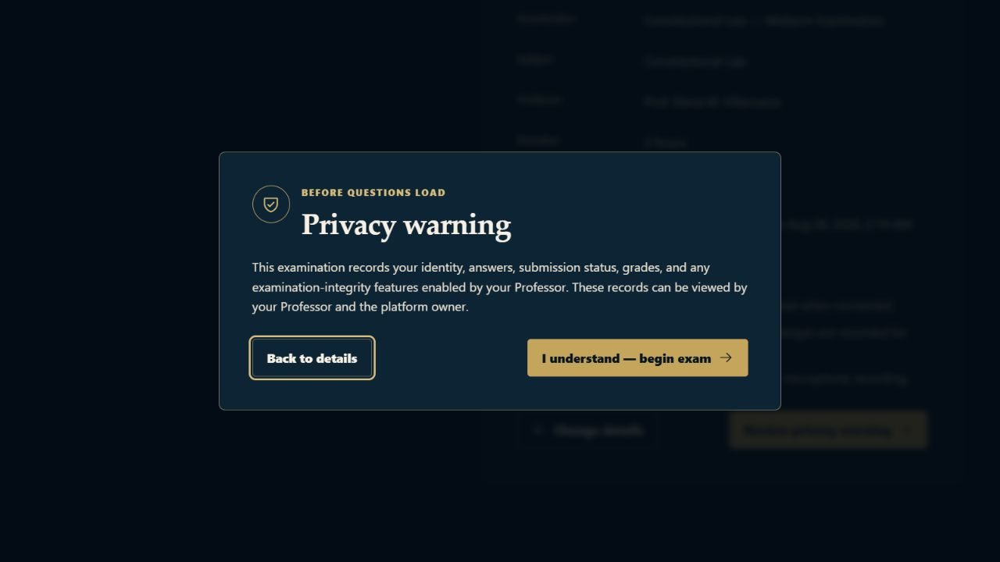

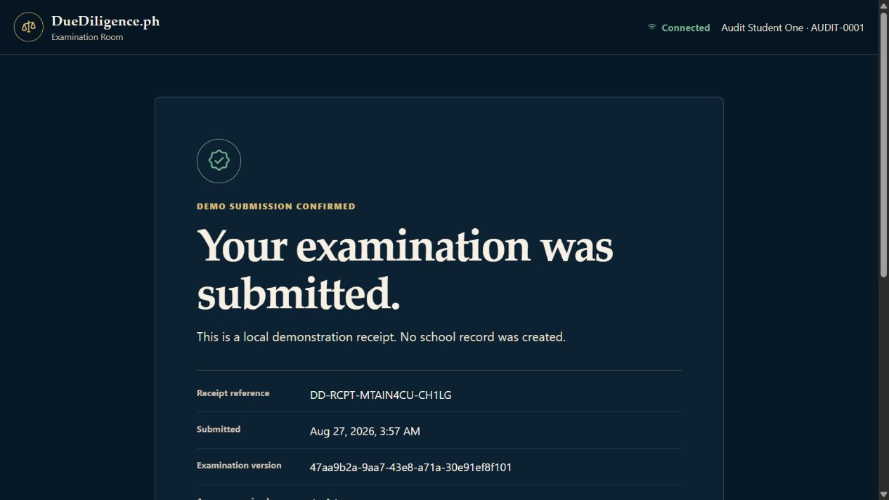

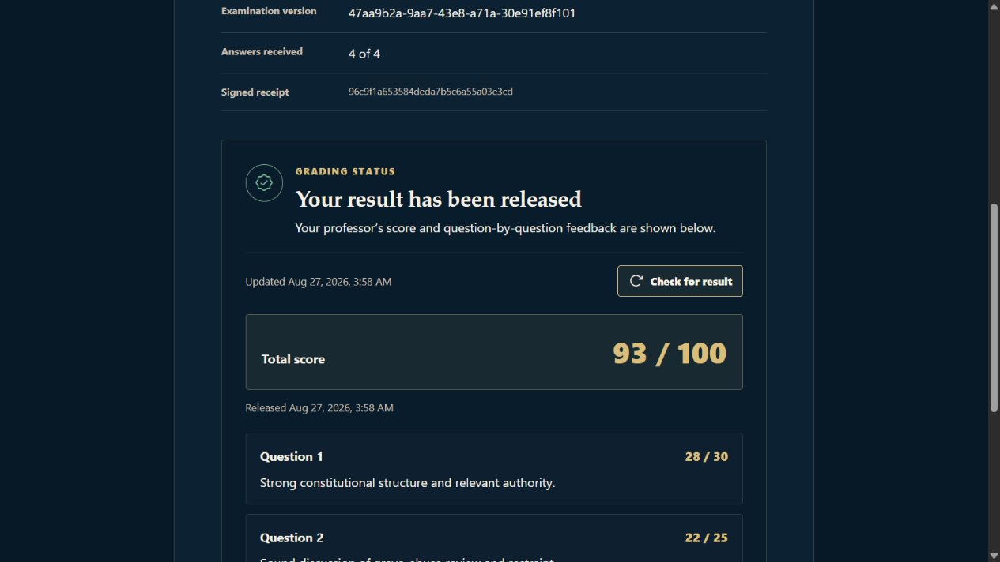

### 6. Monitoring, grading, and owner command center — PASS locally; FAIL on production

The local candidate exposed real-name monitoring, grading, all eight owner tabs, exact questions and answers, grades, keys and email records, recovery records, and JSON/CSV export. A low-contrast examination-ledger defect was found during the visual audit and fixed; the corrected table now keeps names and examination titles readable on the dark Admin theme.

Production still renders the generic Executive Pulse under an Examination Room heading instead of the owner command center.

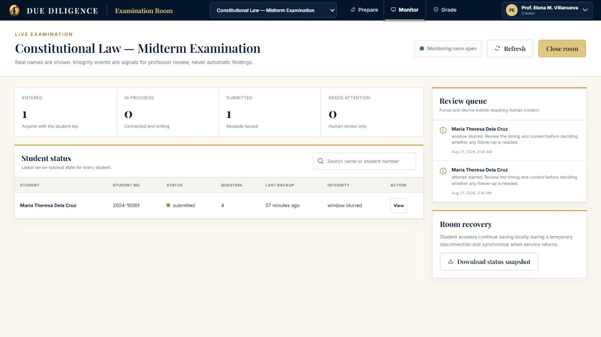

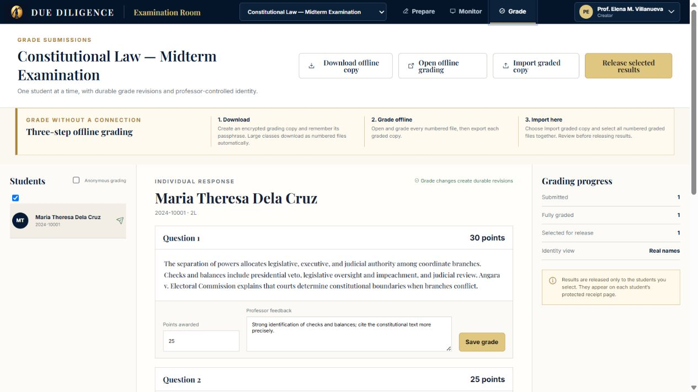

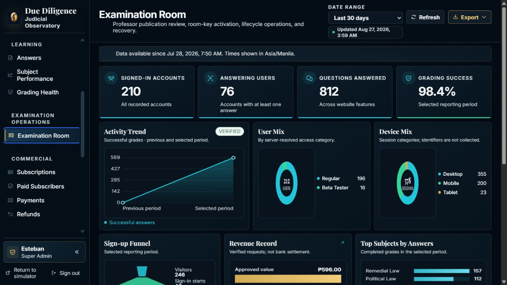

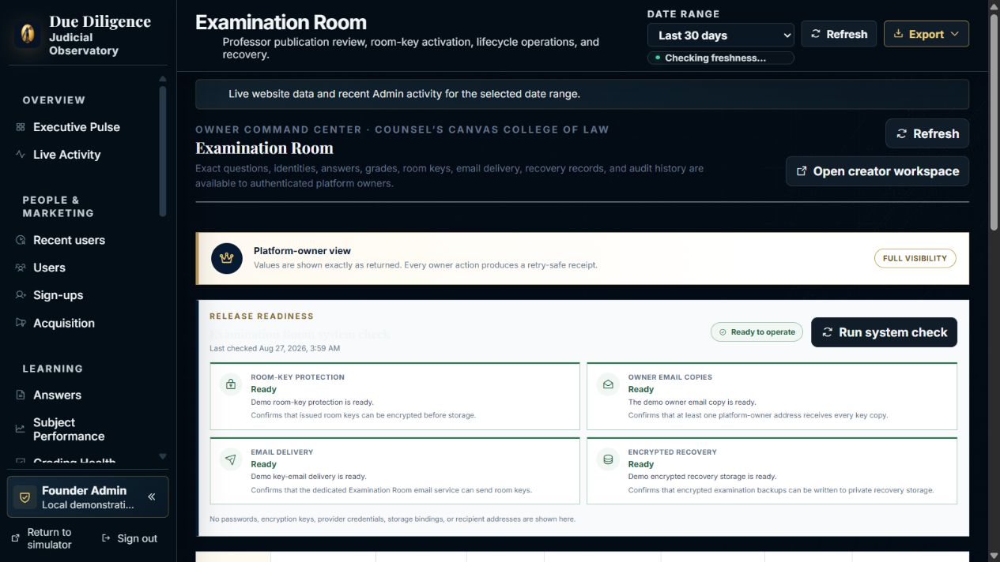

### 7. Ten-exam, thirty-student audit — PASS deterministically

The journey runner executed 10 examinations with 30 virtual students per examination:

- Exams 1–8: key-only admission, no roster or student upload.
- Exams 9–10: optional email allowlist, 30 allowed students each, plus one verified outsider rejection each.
- 300 student journeys.
- 1,200 answer saves.
- 300 submissions.
- 1,200 grading saves.
- 10 result-release batches.
- 300 released results and 300 verified result views.
- 10 idempotent Admin approval replays.
- 10 automatic creator-unlock checks.
- 41 downloadable artifact hashes independently matched; 45 generated files total.

This was a deterministic production-contract runner, not 300 simultaneous browser windows and not a production database run. The separate commercial stress suite also passed 100 examinations x 30 students (3,000 complete journeys), 12,000 answer saves, 3,000 submissions, 12,000 grade saves, 100 approvals, and 100 releases in 20.781 seconds of reported workload time.

Full machine-readable evidence is in `../2026-08-27-examination-room-10x30-delivery-audit/`.

### 8. Browser downloads — PASS locally

The following controls produced parseable, non-empty files through real browser clicks:

| Download | Bytes | SHA-256 |
|---|---:|---|
| `browser-recovery-copy.json` | 3,672 | `84D02599C23B649E9F284EFBBEC77B91AED0D9C719E2553645AA80AFE5E430CD` |
| `browser-monitor-status.json` | 2,013 | `E5F9060EB7BEFAD53F6700295E18C0FDD9742AFDE06F5BDD1565BCB30D288498` |
| `browser-offline-grading.ddgrade.json` | 8,165 | `F4138BA5A3D567E7D455B20DE5CAA41B93BA1032077B7688DCBA3041C67F53FB` |
| `browser-admin-overview.json` | 9,439 | `467B4C852CDBFA7452B052B384235BE1775FC9F6489F68915AAB7ADF1476115F` |
| `browser-admin-overview.csv` | 1,816 | `CEA46A6C790CFB838B62A15D7FEE25980274AAE66C94E5C66C88D6FBE6F7EF9B` |

The offline grading package reports AES-GCM encryption with PBKDF2-SHA256 (310,000 iterations); the inspected ciphertext did not expose the student's plaintext name or answer.

### 9. Email delivery — PARTIAL / no real send

The candidate now includes branded Due Diligence emails for publication request, key approval, key resend, key rotation, and result release. Result-release delivery has a durable per-student outbox, batches up to 100 provider requests, records provider outcomes, and treats a stored `sent` outcome as terminal on replay. The test transport accepted all five paths, including result release as `mock_result_release_05`.

No message was sent to the requested Gmail address. Production is stale, staging explicitly suppresses outbound email, and no safe candidate deployment exists yet. A local/demo banner saying that email was sent is simulated UI evidence and is not provider evidence.

### 10. Deployment gate — BLOCKED

The release must apply in this order: database migrations, private R2 backup bucket and lifecycle, Worker, then frontend. Current blockers:

1. Enable R2 in the Cloudflare dashboard; the API currently returns code `10042`.
2. Add GitHub Actions secrets `EXAMINATION_ROOM_STAGING_DATABASE_URL` and `EXAMINATION_ROOM_PRODUCTION_DATABASE_URL`.
3. Run the isolated staging gate and obtain a real provider acceptance ID before production promotion.

## Settled regression results

- Examination Room client/demo: 62/62.
- Admin client/owner: 33/33.
- Admin subscription worker: 5/5.
- Worker Examination Room suites: 114/114.
- Database: 139/139 assertions plus live result-email claim, completion, and replay checks.
- Door/menu contract: 66/66 assertions.
- Release-workflow contract: 150/150 assertions.
- Ten-exam/30-student delivery audit: PASS.
- Commercial 100-exam/30-student stress audit: PASS.
- Four-migration release bundle: 459,537 bytes; SHA-256 `0b8bcfb5373b2ad6ea28702e92d69460e90f6f4fbd9cb0c4434987519ea2d23b`.
- Syntax and diff checks: PASS; Windows line-ending notices only.

## Brutally honest limitations

- The deployed public site does not satisfy the user's requested access flow today.
- The successful creator, Admin, student, grading, and download browser journeys were run against the local candidate demo, not production Supabase.
- The 300-student requested audit is deterministic contract-level testing; only one complete student journey was performed through the visible browser UI.
- Real Gmail delivery is unproven because no provider accepted a candidate message.
- Camera/microphone recording remains deliberately unavailable in the candidate when encrypted capture storage is not configured.
- Visual inspection covered the supplied desktop viewport and the core journey. It was not a full device-lab or browser-matrix certification.

## Accessibility review limits

The audit inspected semantic labels, landmarks, live statuses, persistent error/recovery text, keyboard-addressable controls visible in the browser accessibility snapshot, and desktop contrast for the core journey. It did not include a dedicated screen-reader session, switch-control testing, zoom/reflow at every breakpoint, or a formal WCAG conformance certification. The Admin ledger contrast issue found during review was corrected and rechecked visually.
